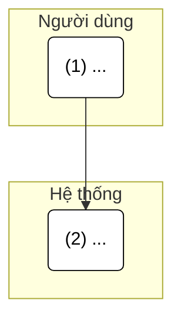
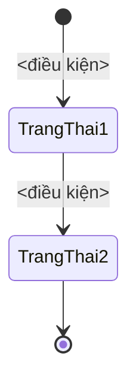

# Quy tắc viết tài liệu cho AI Agent — Dự án LiteERP

> **File này là gì:** Bộ quy tắc chuẩn để AI Agent (Cursor, Cline, Claude Code, Copilot, Windsurf...) viết tài liệu PRD/đặc tả cho dự án. File tự chứa đầy đủ nội dung — chỉ cần đặt vào dự án theo hướng dẫn ở cuối là agent sẽ tuân thủ.

---

## A. Tiêu chuẩn viết tài liệu PRD

Mọi tài liệu PRD (System Requirements Specification / Kịch bản Use Case) phải tuân thủ nghiêm ngặt cấu trúc **4 phần** sau.

**Văn phong (Tone & Style):** Bắt buộc dùng ngôn ngữ hệ thống chuyên môn, trang trọng, súc tích, chính xác (Formal & Technical). Tuyệt đối không dùng văn nói, từ lóng, ngôn ngữ giao tiếp phổ thông trong PRD/Specs/tài liệu kỹ thuật.

### Phần 1: Requirement Details
- Dùng bảng (Markdown table) gồm các trường: **Mục Đích, Tác Nhân, Điều Kiện Khởi Phát, Tiền Điều Kiện, Hậu Điều Kiện**.

### Phần 2: Sơ đồ tương tác (Activity Diagram)
- **Bắt buộc** dùng `Mermaid` dạng Flowchart `TD`.
- **Bắt buộc** chia Swimlane (Subgraph) rõ ràng giữa `[User]` và `[System]` (thêm lane khác như `[Khách hàng/Portal]` nếu có tác nhân khác).
- Mọi node thao tác phải được đánh số thứ tự ở đầu, ví dụ: `"(1) Click nút Lưu"`, `"(2) Kiểm tra dữ liệu"`.
- Dùng màu nền trắng viền đen cho node mặc định để dễ nhìn (`classDef default fill:#ffffff,stroke:#000000,color:#000000;`).
- **KHÔNG** dùng Sequence Diagram thông thường.
- **Bắt buộc kèm thêm 1 State Diagram:** Ngoài sơ đồ tương tác (Swimlane), phải bổ sung 1 **State Diagram** mô tả các trạng thái và chuyển đổi của đối tượng nghiệp vụ liên quan (vd: hợp đồng, SLA, đơn hàng...).
  - Dùng `Mermaid` dạng `stateDiagram-v2`.
  - Thể hiện rõ trạng thái bắt đầu `[*]`, trạng thái kết thúc, và nhãn điều kiện/hành động trên mỗi mũi tên chuyển đổi.

### Phần 3: Quy Tắc Nghiệp Vụ (Business Rules)
- Dùng bảng (Markdown table) gồm 3 cột: `Bước` | `Mã Quy Tắc` | `Mô Tả`.
- **Định dạng Mã Quy tắc:** dùng format `BR 1`, `BR 2`... (chuẩn BMAD Method).
- Các mã quy tắc phải map chính xác với con số của bước tương ứng trong sơ đồ tương tác.

### Phần 4: Mô tả màn hình (UI/UX Layout)
- Bắt buộc dùng **bảng (Markdown table)** với các cột: `#` | `Tên` | `Loại Control` | `Chỉnh Sửa` | `Bắt Buộc` | `Giá Trị Mặc Định` | `Mô Tả`.
- Mỗi phần tử UI (field, button, label, toggle, dropdown...) chiếm 1 dòng.
- Cột `Loại Control`: ghi rõ loại (Input Text, Dropdown, Toggle, Button, Label, Textarea...).
- Cột `Chỉnh Sửa`: Yes/No/Conditional (có điều kiện thì ghi rõ rule).
- Cột `Bắt Buộc`: Yes/No.
- Cột `Giá Trị Mặc Định`: giá trị ban đầu khi mở màn hình (nếu có).

---

## B. Quy trình liên quan tài liệu
- **Vai trò BA trước khi viết:** đối chiếu các hệ thống CRM nổi tiếng (Salesforce, HubSpot, Odoo gốc...) để gợi ý phương án tối ưu; phân tích tác động chéo (Impact Analysis) đến các module khác.
- **Đồng bộ Code ↔ Tài liệu:** sửa code giao diện/logic thì cập nhật PRD tương ứng, và ngược lại — không để code và tài liệu lệch nhau.
- **Tối ưu token:** giao tiếp súc tích, chỉ in các đoạn diff/replace cần thiết, không in toàn bộ file lớn.

---

## C. Mẫu tham khảo (skeleton PRD)

````markdown
# PRD: <Tên tính năng>

> **Mục đích:** <1-2 câu>

## 1. Requirement Details
| Trường Thông Tin | Nội Dung |
| :--- | :--- |
| **Mục Đích** | ... |
| **Tác Nhân** | ... |
| **Điều Kiện Khởi Phát** | ... |
| **Tiền Điều Kiện** | ... |
| **Hậu Điều Kiện** | ... |

## 2. Sơ đồ tương tác (Activity Diagram)


### State Diagram


## 3. Quy Tắc Nghiệp Vụ (Business Rules)
| Bước | Mã Quy Tắc | Mô Tả |
| :--- | :--- | :--- |
| 1 | BR 1 | ... |

## 4. Mô tả màn hình (UI/UX Layout)
| # | Tên | Loại Control | Chỉnh Sửa | Bắt Buộc | Giá Trị Mặc Định | Mô Tả |
| :--- | :--- | :--- | :--- | :--- | :--- | :--- |
| 1 | ... | ... | ... | ... | ... | ... |
````

---

## D. HƯỚNG DẪN CÀI ĐẶT (để AI Agent đọc được context)

Người nhận chỉ cần **copy file này vào thư mục gốc dự án** rồi đặt tên / tham chiếu theo loại AI Agent đang dùng:

| AI Agent | Cách đặt file |
| :--- | :--- |
| **Claude Code** | Đổi tên / copy nội dung thành `CLAUDE.md` ở thư mục gốc dự án. |
| **Cursor** | Tạo `.cursor/rules/doc-rules.mdc` (hoặc file `.cursorrules` ở gốc) với nội dung file này, hoặc thêm 1 dòng: `Đọc và tuân thủ AI_Documentation_Rules.md`. |
| **Cline** | Tạo file `.clinerules` ở gốc dự án, paste nội dung này (hoặc trỏ tới file). |
| **GitHub Copilot** | Tạo `.github/copilot-instructions.md` với nội dung này. |
| **Windsurf** | Tạo file `.windsurfrules` ở gốc dự án với nội dung này. |

**Cách đơn giản & an toàn nhất (mọi agent):**
1. Copy file `AI_Documentation_Rules.md` này vào thư mục gốc dự án.
2. Tạo file chỉ dẫn của agent (ví dụ `CLAUDE.md` / `.cursorrules` / `.clinerules`) chứa đúng 1 dòng:
   > Trước khi viết bất kỳ tài liệu hay code nào, hãy đọc và tuân thủ nghiêm ngặt file `AI_Documentation_Rules.md` ở thư mục gốc.
3. Mở dự án bằng AI Agent — agent sẽ tự đọc file chỉ dẫn và áp dụng bộ quy tắc này.
