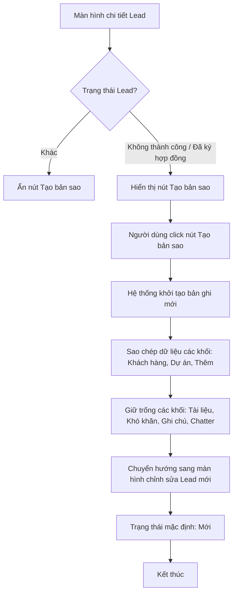

# Requirement Details

| Tiêu chí | Mô tả |
|---|---|
| **Mục Đích** | Cho phép người dùng nhanh chóng tạo một Lead mới dựa trên thông tin từ một Lead cũ đã kết thúc (Thành công hoặc Thất bại) để tiếp tục chăm sóc hoặc triển khai cơ hội mới cho cùng một khách hàng. |
| **Tác Nhân** | Nhân viên kinh doanh (Sales), Quản lý kinh doanh. |
| **Điều Kiện Khởi Phát** | Người dùng click vào nút [Tạo bản sao] tại màn hình chi tiết Lead. |
| **Tiền Điều Kiện** | Lead hiện tại phải ở trạng thái "Không thành công" hoặc "Đã ký hợp đồng". |
| **Hậu Điều Kiện** | Một bản ghi Lead mới được khởi tạo ở trạng thái "Mới" (đầu quy trình). Dữ liệu được sao chép chính xác theo quy tắc. |

# Sơ đồ tương tác

# Quy Tắc Nghiệp Vụ

| Bước | Mã Quy Tắc | Mô Tả |
|---|---|---|
| (1) | BR 1 | Nút [Tạo bản sao] chỉ xuất hiện ở Header màn hình chi tiết khi bản ghi Lead có trạng thái thuộc tập hợp: "Không thành công", "Đã ký hợp đồng". |
| (2) | BR 2 | Lead được tạo ra từ bản sao luôn luôn bắt đầu ở trạng thái đầu tiên của Pipeline (Trạng thái "Mới"), bất kể Lead gốc đang ở trạng thái nào. |
| (3) | BR 3 | Hệ thống thực hiện sao chép toàn bộ dữ liệu (Deep Copy) của các khối sau: - Thông tin khách hàng: Tên KH, MST, Phân loại, Lĩnh vực, Website, Địa chỉ, Danh sách Liên hệ khách hàng. - Thông tin dự án: Danh sách dịch vụ, Doanh thu dự kiến, Cơ cấu vốn. - Thông tin thêm: Các mốc thời gian, Nguồn, Đội ngũ sales, Đối tác. |
| (4) | BR 4 | Các khối thông tin sau sẽ được để trống hoàn toàn trên bản sao mới: - Tài liệu: Không sao chép các file đính kèm. - Khó khăn, đề xuất: Reset nội dung text. - Ghi chú nội bộ: Reset nội dung text. - Chatter (Log/Comment): Không sao chép lịch sử tương tác và thảo luận từ Lead cũ. |
| (5) | BR 5 | Tên Lead mới được mặc định là: "[Copy] + Tên Lead gốc" để người dùng dễ dàng phân biệt. |
| (6) | BR 6 | Khi tạo mới thành công, hệ thống tự động ghi một log mặc định *"Đã tạo bản sao từ Lead [Tên Lead gốc]"* vào tab Lịch sử hoạt động. |

# Mô tả màn hình

- **Vị trí nút bấm:** Nút `[Tạo bản sao]` nằm trên thanh Action bar (Header), bên trái nút `[Lưu]`.
- **Thao tác người dùng:**
  - Hệ thống tự động Redirect người dùng sang trang chỉnh sửa của bản ghi mới.
  - Các khối thông tin được sao chép hiển thị dữ liệu đầy đủ.
  - Các khối không được sao chép hiển thị trạng thái trống (Empty state).
