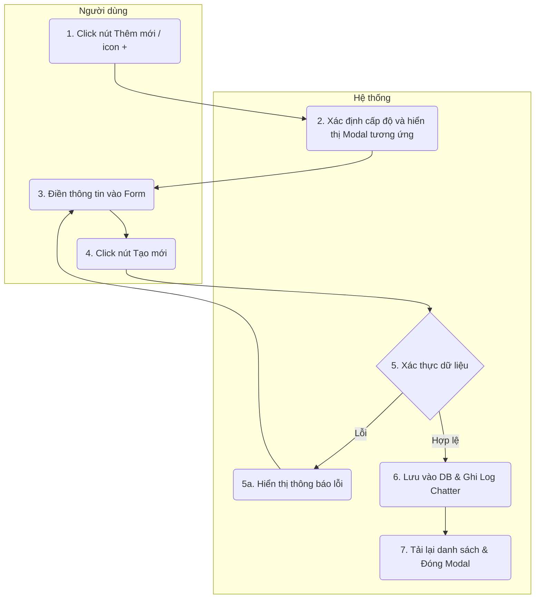

# Requirement Details

| Tiêu chí | Mô tả |
|---|---|
| **Mục Đích** | Cho phép người dùng tạo mới Danh mục sản phẩm (Level 1), Dòng sản phẩm (Level 2), hoặc Sản phẩm / Gói dịch vụ (Level 3) vào hệ thống. |
| **Tác Nhân** | Người quản trị hệ thống / Nhân viên kinh doanh. |
| **Điều Kiện Khởi Phát** | Người dùng click vào nút `[+ Thêm Danh mục sản phẩm]` hoặc click vào icon `[+]` trên một dòng dữ liệu ở màn hình danh sách. |
| **Tiền Điều Kiện** | Người dùng đã đăng nhập và được phân quyền thêm mới sản phẩm trong hệ thống. |
| **Hậu Điều Kiện** | Bản ghi cấp danh mục hoặc sản phẩm mới được lưu vào cơ sở dữ liệu. Log khởi tạo được ghi nhận. Màn hình danh sách tự động cập nhật để hiển thị bản ghi mới. |

# Sơ đồ tương tác

# Quy Tắc Nghiệp Vụ

| Bước | Mã Quy Tắc | Mô Tả |
|---|---|---|
| (2) | BR 1 | Tùy thuộc vào vị trí click `[+]` (nằm ở dòng Danh mục hay Dòng sản phẩm) hoặc click nút `[Thêm]` ở Header, hệ thống sẽ tự động xác định cấp độ (Level 1, 2 hoặc 3) cần tạo và hiển thị form tương ứng với các trường dữ liệu phù hợp. Thuộc tính "Cấp cha" sẽ được tự động điền sẵn dựa trên dòng được click. |
| (5) | BR 2 | Xác thực dữ liệu bắt buộc: - Danh mục (Level 1): Phải nhập Tên. - Dòng sản phẩm (Level 2): Phải chọn Thuộc Danh mục (Level 1) và nhập Tên. - Sản phẩm (Level 3): Phải chọn Thuộc Dòng sản phẩm (Level 2) và nhập Tên. |
| (5a) | BR 3 | Nếu người dùng bỏ trống trường bắt buộc, hệ thống hiển thị thông báo lỗi và ngăn chặn việc lưu trữ. <ul><li>Common rule cảnh báo lỗi hệ thống: [Common Rules](#)</li></ul> |
| (3) | BR 4 | Trạng thái "Đang hoạt động / Ngừng hoạt động" sử dụng UI dạng Toggle switch. Mặc định khi tạo mới bản ghi, công tắc này luôn được bật sẵn ở trạng thái "Đang hoạt động" (Active). |
| (3) | BR 5 | Đối với sản phẩm Level 3, người dùng có thể nhập bổ sung các thông tin bán hàng: **Đơn giá** (định dạng số tiền VNĐ), **Đơn vị tính** (Combobox thông minh cho phép tự nhập tay thêm đơn vị mới ngoài danh sách: seat, license...), và **Mức thuế** (%). |
| (6) | BR 6 | Khi tạo mới thành công, hệ thống lưu dữ liệu vào DB và tự động khởi tạo một log mặc định có nội dung *"Đã tạo mới bản ghi."* vào tab Lịch sử hoạt động (Chatter) để phục vụ việc tra cứu timeline sau này. <ul><li>Common rule Lịch sử hoạt động: [Lịch sử hoạt động](#)</li></ul> |

# Mô tả màn hình

### Form Level 1: Thêm mới Danh mục sản phẩm

| # | Tên | Loại Control | Chỉnh Sửa | Bắt Buộc | Giá Trị Mặc Định | Mô Tả |
|---|---|---|---|---|---|---|
| 1 | Đang hoạt động | Toggle Switch | Yes | Yes | Bật (Active) | Nằm ở góc phải trên. Cho phép bật/tắt trạng thái hiển thị của danh mục. |
| 2 | Tên | Input Text | Yes | Yes | Nhập tên... | Tên của danh mục sản phẩm mới. |
| 3 | Mô tả | Textarea | Yes | No | Nhập mô tả... | Khối text cho phép nhập giải thích chi tiết về danh mục. |
| 4 | Hủy | Button | Yes | - | - | Đóng cửa sổ, hủy bỏ mọi thao tác. |
| 5 | Tạo mới | Button (Primary) | Yes | - | - | Validate dữ liệu. Nếu hợp lệ tiến hành lưu vào DB. |

### Form Level 2: Thêm mới Dòng sản phẩm

| # | Tên | Loại Control | Chỉnh Sửa | Bắt Buộc | Giá Trị Mặc Định | Mô Tả |
|---|---|---|---|---|---|---|
| 1 | Đang hoạt động | Toggle Switch | Yes | Yes | Bật (Active) | Nằm ở góc phải trên. Cho phép bật/tắt. |
| 2 | Thuộc Danh mục | Dropdown | Yes | Yes | (Lấy từ cha) | Chọn danh mục cấp 1 để làm thẻ cha. |
| 3 | Tên | Input Text | Yes | Yes | Nhập tên... | Tên của dòng sản phẩm. |
| 4 | Mô tả | Textarea | Yes | No | Nhập mô tả... | Khối text ghi chú. |
| 5 | Hủy | Button | Yes | - | - | Đóng cửa sổ, hủy bỏ thao tác. |
| 6 | Tạo mới | Button (Primary) | Yes | - | - | Validate dữ liệu và lưu. |

### Form Level 3: Thêm mới Sản Phẩm / Gói dịch vụ

| # | Tên | Loại Control | Chỉnh Sửa | Bắt Buộc | Giá Trị Mặc Định | Mô Tả |
|---|---|---|---|---|---|---|
| 1 | Đang hoạt động | Toggle Switch | Yes | Yes | Bật (Active) | Nằm ở góc phải trên. Cho phép bật/tắt. |
| 2 | Thuộc Dòng SP | Dropdown | Yes | Yes | (Lấy từ cha) | Chọn dòng sản phẩm cấp 2. |
| 3 | Tên | Input Text | Yes | Yes | Nhập tên... | Tên của gói dịch vụ/sản phẩm. |
| 4 | Mô tả | Textarea | Yes | No | Nhập mô tả... | Khối text ghi chú. |
| 5 | Đơn giá (VNĐ) | Input Number | Yes | No | 0 | Giá bán thực tế của sản phẩm. Format hiển thị phân cách hàng nghìn. |
| 6 | Đơn vị tính | Combobox | Yes | No | -- Chọn giá trị -- | Combobox cho phép chọn (seat, license...) hoặc tự gõ thêm. |
| 7 | Mức Thuế (%) | Combobox | Yes | No | -- Chọn giá trị -- | Combobox thuế áp dụng. |
| 8 | Hủy | Button | Yes | - | - | Đóng cửa sổ, hủy bỏ thao tác. |
| 9 | Tạo mới | Button (Primary) | Yes | - | - | Validate dữ liệu và lưu. |
