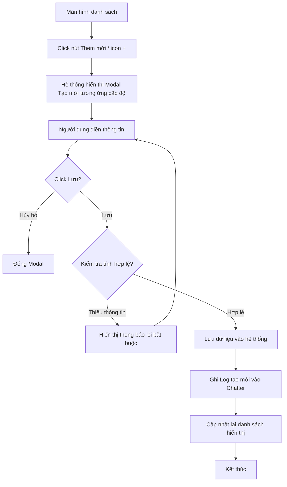

# Requirement Details

| Tiêu chí | Mô tả |
|---|---|
| **Mục Đích** | Cho phép người dùng tạo mới Danh mục sản phẩm (Level 1), Dòng sản phẩm (Level 2), Sản phẩm / Gói dịch vụ (Level 3) vào hệ thống. |
| **Tác Nhân** | Người quản trị hệ thống / Nhân viên kinh doanh. |
| **Điều Kiện Khởi Phát** | Người dùng click vào nút [Thêm Danh mục sản phẩm] hoặc nút icon [+] trên một dòng ở màn hình danh sách. |
| **Tiền Điều Kiện** | Người dùng được phân quyền thêm mới sản phẩm trong hệ thống. |
| **Hậu Điều Kiện** | Bản ghi cấp danh mục hoặc sản phẩm mới được lưu vào cơ sở dữ liệu. Log khởi tạo được ghi nhận. Màn hình danh sách tự động cập nhật để hiển thị bản ghi mới. |

# Sơ đồ tương tác

# Quy Tắc Nghiệp Vụ

| Bước | Mã Quy Tắc | Mô Tả |
|---|---|---|
| (1) | BR 1 | Tùy thuộc vào vị trí click `[+]` (ở cấp nhóm nào) hoặc nút `[Thêm]`, hệ thống sẽ tự động xác định cấp độ (Level 1, 2 hoặc 3) cần tạo và hiển thị form tương ứng với các trường dữ liệu phù hợp. |
| (2) | BR 2 | Xác thực dữ liệu bắt buộc: - **Danh mục (Level 1)**: Phải nhập Tên. - **Dòng sản phẩm (Level 2)**: Phải chọn Danh mục cha (Level 1) và nhập Tên. - **Sản phẩm (Level 3)**: Phải chọn Dòng sản phẩm cha (Level 2) và nhập Tên. |
| (2), (3) | BR 3 | Nếu người dùng bỏ trống trường bắt buộc, hệ thống hiển thị thông báo lỗi (Ví dụ: *"Vui lòng nhập tên"*, *"Vui lòng chọn Danh mục (Cấp 1)"*) và ngăn chặn việc lưu trữ. |
| (3) | BR 4 | Trạng thái "Đang hoạt động / Ngừng hoạt động" sử dụng UI dạng Toggle switch. Mặc định khi tạo mới bản ghi luôn ở trạng thái "Đang hoạt động". |
| (4) | BR 5 | Đối với sản phẩm Level 3, người dùng có thể nhập bổ sung thông tin bán hàng: **Đơn giá** (VNĐ), **Đơn vị tính** (dạng combobox cho phép tự nhập hoặc chọn: seat, license...), và **Mức thuế** (%). |
| (5) | BR 6 | Khi tạo mới thành công, hệ thống tự động ghi một log mặc định *"Đã tạo mới bản ghi."* vào tab Lịch sử hoạt động (Chatter) để phục vụ tra cứu sau này. |

# Mô tả màn hình

- **Tiêu đề Modal:** Hệ thống tự động động hóa tiêu đề: "Thêm mới Danh mục sản phẩm", "Thêm mới Dòng sản phẩm", hoặc "Thêm mới Sản Phẩm / Gói dịch vụ" tùy theo ngữ cảnh mà người dùng thao tác.
- **Form nhập liệu:**
  - **Level 1:** Chỉ bao gồm field nhập `Tên`, `Mô tả`, `Trạng thái`.
  - **Level 2:** Bao gồm field chọn `Thuộc Danh mục` (Dropdown), `Tên`, `Mô tả`, `Trạng thái`.
  - **Level 3:** Bao gồm field chọn `Thuộc Dòng sản phẩm` (Dropdown), `Tên`, `Mô tả`, `Đơn giá`, `Đơn vị tính`, `Mức thuế`, `Trạng thái`.
- **Nút thao tác:** 
  - `[Hủy bỏ]`: Đóng modal, không lưu dữ liệu.
  - `[Tạo mới]`: Thực hiện kiểm tra validate và lưu thông tin vào hệ thống. Màn hình tự tải lại dữ liệu sau khi lưu.
| (3) | BR 3 | Trạng thái "Đang hoạt động / Ngừng hoạt động" sử dụng UI dạng Toggle switch. Mặc định khi tạo mới bản ghi luôn ở trạng thái "Đang hoạt động". |
| (4) | BR 4 | Đối với sản phẩm Level 3, người dùng có thể nhập bổ sung thông tin bán hàng: **Đơn giá** (VNĐ), **Đơn vị tính** (dạng combobox cho phép tự nhập hoặc chọn: seat, license...), và **Mức thuế** (%). |
| (5) | BR 5 | Khi tạo mới thành công, hệ thống tự động ghi một log mặc định *"Đã tạo mới bản ghi."* vào tab Lịch sử hoạt động (Chatter) để phục vụ tra cứu sau này. <ul><li>Common rule Lịch sử hoạt động: [3. Lịch sử hoạt động](#)</li></ul> |

# Mô tả màn hình

- **Tiêu đề Modal:** Hệ thống tự động động hóa tiêu đề: "Thêm mới Danh mục sản phẩm", "Thêm mới Dòng sản phẩm", hoặc "Thêm mới Sản Phẩm / Gói dịch vụ" tùy theo ngữ cảnh.
- **Bố cục Form:**
  - **Level 1:** Trường `Tên`, `Mô tả`, `Trạng thái`.
  - **Level 2:** Trường `Thuộc Danh mục` (Dropdown), `Tên`, `Mô tả`, `Trạng thái`.
  - **Level 3:** Trường `Thuộc Dòng sản phẩm` (Dropdown), `Tên`, `Mô tả`, `Đơn giá`, `Đơn vị tính`, `Mức thuế`, `Trạng thái`.
- **Nút thao tác:** 
  - `[Hủy bỏ]`: Đóng modal, không lưu dữ liệu.
  - `[Tạo mới]`: Thực hiện kiểm tra validate và lưu thông tin.
