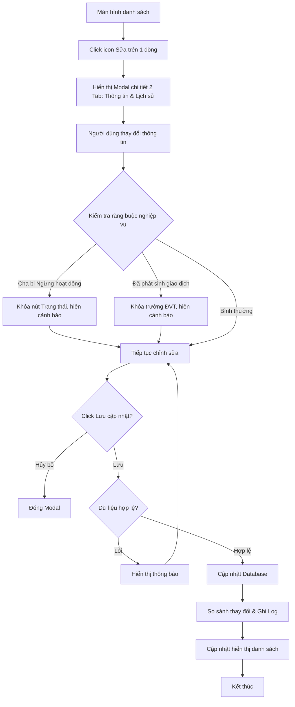

# Requirement Details

| Tiêu chí | Mô tả |
|---|---|
| **Mục Đích** | Cho phép người dùng cập nhật thông tin của một Danh mục sản phẩm, Dòng sản phẩm, Sản phẩm / Gói dịch vụ hoặc chuyển đổi trạng thái hoạt động, đồng thời lưu lại lịch sử thay đổi (Audit trail). |
| **Tác Nhân** | Người quản trị hệ thống / Nhân viên kinh doanh. |
| **Điều Kiện Khởi Phát** | Người dùng click vào icon **[Sửa]** (Edit) trên một dòng Sản phẩm ở màn hình danh sách. |
| **Tiền Điều Kiện** | Người dùng được phân quyền chỉnh sửa sản phẩm. Sản phẩm đó phải tồn tại trong hệ thống. |
| **Hậu Điều Kiện** | Thông tin mới của sản phẩm được cập nhật vào cơ sở dữ liệu. Các thay đổi được ghi nhận vào tab "Lịch sử hoạt động" (Chatter log). Màn hình danh sách chính tự động làm mới để phản ánh dữ liệu mới. |

# Sơ đồ tương tác

# Quy Tắc Nghiệp Vụ

| Bước | Mã Quy Tắc | Mô Tả |
|---|---|---|
| (2) | BR 1 | Khi mở bản ghi sản phẩm Level 3, hệ thống kiểm tra xem sản phẩm này đã phát sinh giao dịch chưa (VD: đã nằm trong Báo giá, Hóa đơn). Nếu đã có, hệ thống hiển thị dải cảnh báo (màu vàng) báo hiệu: *"Đang được dùng trong X (số lượng) Báo giá, Y (số lượng) Hóa đơn"*. Các module liên quan đến sản phẩm bao gồm: Báo giá, Hóa đơn. |
| (2), (5) | BR 2 | Nếu sản phẩm đã phát sinh giao dịch, trường **Đơn vị tính** sẽ bị khóa cứng (Disabled/Lock icon) không cho phép người dùng thay đổi, nhằm tránh sai lệch dữ liệu kế toán của các đơn cũ. |
| (4) | BR 3 | Trạng thái "Đang hoạt động / Ngừng hoạt động" sử dụng UI dạng Toggle switch. Có tooltip: *"Tắt trạng thái này để ngừng bán sản phẩm. Dữ liệu trên các đơn hàng cũ không bị ảnh hưởng."* |
| (5) | BR 4 | Xác thực dữ liệu bắt buộc: - Phải chọn Dòng sản phẩm (Cấp 2) nếu chỉnh sửa sản phẩm level 3 - Phải chọn Danh mục sản phẩm (Cấp 1) nếu chỉnh sửa sản phẩm level 2 - Phải nhập tên sản phẩm nếu chỉnh sửa mọi cấp độ Nếu người dùng bỏ trống, hệ thống hiển thị hộp thoại cảnh báo lỗi và ngăn chặn việc lưu trữ. |
| (6) | BR 5 | Bất kỳ trường dữ liệu nào bị sửa đổi (Tên, Đơn giá, Trạng thái, ĐVT, Thuế...) đều được hệ thống so sánh tự động và ghi lại vào hệ thống (Tracking). Log này sẽ được hiển thị ở tab "Lịch sử hoạt động" kèm theo tên người sửa và thời gian thay đổi. |
| (2), (8) | BR 6 | - Nếu cấp cha của sản phẩm đang ở trạng thái Ngừng hoạt động, khi mở bản ghi cấp con sẽ có cảnh báo và vô hiệu hóa hoàn toàn nút Toggle Trạng thái để ngăn người dùng thao tác. Cảnh báo: *"Danh mục cha đang Ngừng hoạt động. Bản ghi này hiện bị khóa."* - Khi cấp cha có trạng thái Ngừng hoạt động, các sản phẩm cấp con sẽ bị đánh dấu gạch ngang tên trên danh sách để nhận diện trực quan. |

# Mô tả màn hình

- **Bố cục Modal:** Được chia làm 2 tab chính:
  - **Thông tin chung:** Nơi cho phép người dùng xem và cập nhật dữ liệu. Các dải cảnh báo (màu vàng) sẽ xuất hiện trên cùng tab này nếu bản ghi vướng ràng buộc (khóa trạng thái, đang được dùng).
  - **Lịch sử hoạt động:** (Chatter) Hiển thị theo dạng Timeline. Ghi nhận thời gian, tác nhân và danh sách các thay đổi giá trị (VD: `Đơn giá: 0 -> 500,000`).
- **Control Trạng thái:** Sử dụng dạng toggle switch kèm biểu tượng màu sắc (Xanh lá: Đang hoạt động, Xám: Ngừng hoạt động). Nút này sẽ bị mờ đi nếu dính quy tắc BR 6.
- **Nút bấm:** `[Hủy bỏ]` đóng cửa sổ, `[Lưu cập nhật]` để xác nhận các chỉnh sửa.
