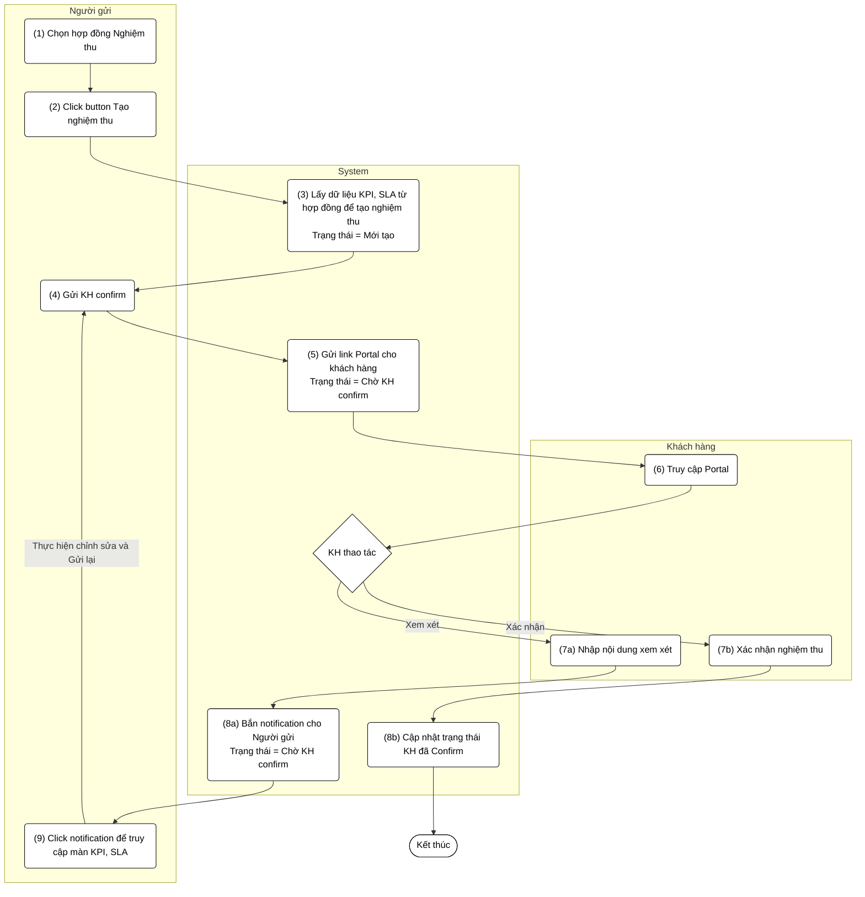
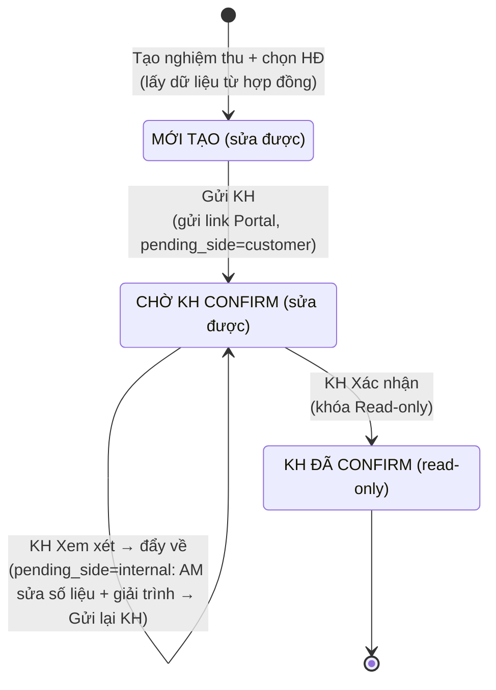

# Luồng: Tạo nghiệm thu KPI/SLA (đồng bộ dữ liệu từ Hợp đồng)

## 1. Sơ đồ tương tác (Swimlane)

## 2. State Diagram — Trạng thái bản nghiệm thu KPI/SLA

## 3. Trạng thái

| Trạng thái | Sửa được? | Mô tả |
|------------|-----------|-------|
| MỚI TẠO | ✅ | Vừa tạo nghiệm thu, KPI/SLA lấy dữ liệu từ hợp đồng |
| CHỜ KH CONFIRM | ✅ | Đã gửi link Portal; giữ nguyên khi KH "Xem xét" đẩy về (AM sửa số liệu + giải trình rồi gửi lại) |
| KH ĐÃ CONFIRM | ❌ | Khách hàng đã xác nhận nghiệm thu, khóa Read-only |

> Chi tiết logic ẩn (cờ `pending_side` điều khiển nút "Gửi KH", `review_comment`, `am_response`, `review_round`, quy tắc Read-only) được mô tả trong Business Rules của PRD: `docs/PRDs/Prd_Tao_Nghiem_Thu_KPI_SLA.md`.
