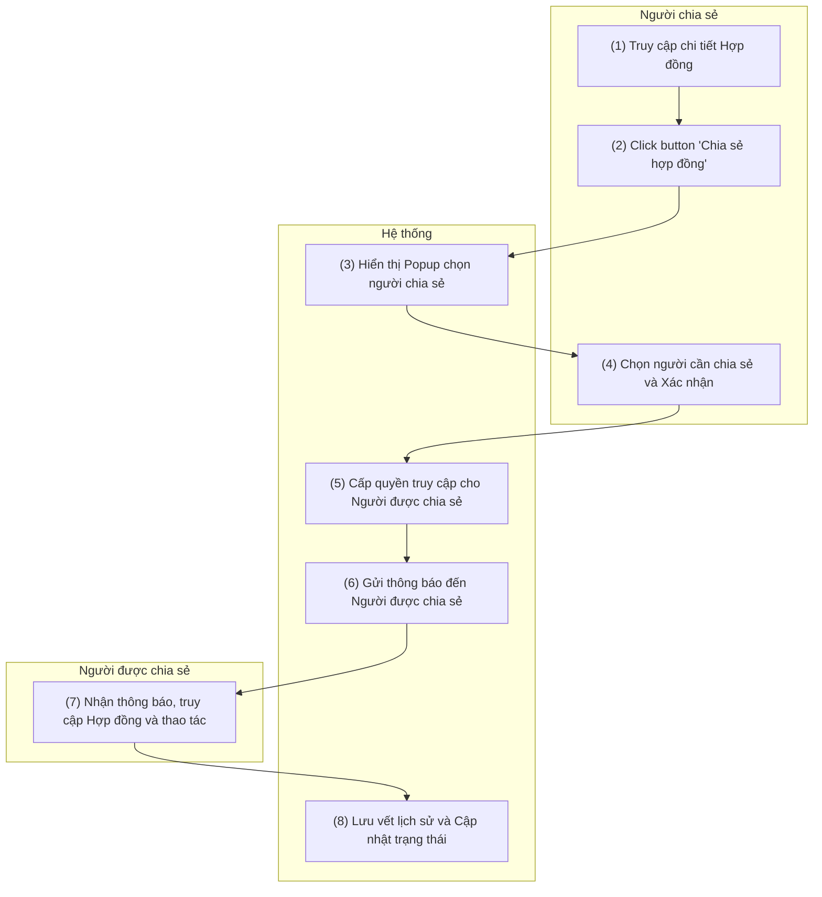

# PRD: Chia sẻ Hợp đồng

> **Mục đích:** Đặc tả luồng xử lý và cấp quyền ủy quyền/chia sẻ hợp đồng cho người dùng khác trong hệ thống để thực hiện các thao tác tiếp nối (Duyệt, chỉnh sửa...).

## 1. Requirement Details

| Tiêu chí | Mô tả |
| :--- | :--- |
| **Purpose** | Chức năng này cho phép người dùng thực hiện chia sẻ hợp đồng cho người dùng khác. |
| **Actor** | Người tạo hợp đồng, Người duyệt |
| **Trigger** | Người dùng click button **Chia sẻ hợp đồng** khi hợp đồng ở trạng thái: *Chờ Duyệt, Đã Duyệt, Chờ KH Confirm, KH Đã Confirm, Chờ xác nhận* |
| **Pre-condition** | - Người dùng đã đăng nhập thành công vào hệ thống và có quyền truy cập Danh sách hợp đồng. - Người dùng được phép truy cập chi tiết hợp đồng. - Hợp đồng đang ở trạng thái: *Chờ Duyệt, Đã Duyệt, Chờ KH Confirm, KH Đã Confirm, Chờ xác nhận*. |
| **Post-condition** | - Người được chia sẻ hợp đồng có **chức năng tương tự** với người chia sẻ hợp đồng. - Nếu người được chia sẻ hợp đồng đã thao tác bất kì hành động nào đối với hợp đồng -> Hợp đồng sẽ được **cập nhật ở trạng thái mới nhất**. |

## 2. Sơ đồ tương tác (Activity Diagram - Swimlane)

## 3. Quy Tắc Nghiệp Vụ (Business Rules)

| Bước | Mã Quy Tắc | Mô Tả |
| :---: | :---: | :--- |
| (1) - (2) | **BR 1** | **Điều kiện hiển thị Nút chia sẻ:** Button "Chia sẻ hợp đồng" chỉ được phép hiển thị và enable (có thể click) khi hợp đồng đang ở 1 trong 5 trạng thái: `Chờ Duyệt`, `Đã Duyệt`, `Chờ KH Confirm`, `KH Đã Confirm`, `Chờ xác nhận`. (Ẩn hoặc vô hiệu hóa ở các trạng thái khác). |
| (3) - (4) | **BR 2** | **Popup Chọn người chia sẻ:** Khi hiển thị màn hình chọn người được chia sẻ, hệ thống chỉ hiển thị các User có trạng thái Active (Đang hoạt động) trong hệ thống để ngăn chặn việc share cho tài khoản đã nghỉ việc. |
| (5) | **BR 3** | **Kế thừa quyền thao tác:** Người được chia sẻ sẽ nhận được toàn bộ bộ quyền thao tác ĐÚNG NHƯ của người chia sẻ (Ủy quyền tác vụ). Ví dụ: Nếu người chia sẻ là Người duyệt, thì người được chia sẻ cũng thấy và click được nút "Phê duyệt". |
| (6) | **BR 4** | **Thông báo (Notification):** Khi cấp quyền thành công, hệ thống tự động gửi Notification cho người được chia sẻ với nội dung: *"Người dùng [Tên người chia sẻ] vừa chia sẻ hợp đồng [Mã hợp đồng] cho bạn"*. Khi click vào thông báo này, hệ thống sẽ tự động chuyển hướng (redirect) người dùng vào thẳng màn hình chi tiết của chính hợp đồng đó. |
| (7) - (8) | **BR 5** | **Lưu vết và Cập nhật trạng thái:** Mọi thao tác do "Người được chia sẻ" thực hiện lên hợp đồng (như Sửa, Phê duyệt, Hủy) đều có giá trị thực thi. Hệ thống phải cập nhật trạng thái hợp đồng mới nhất theo thao tác này và ghi nhận log trong Chatter rõ ràng người thực hiện thực tế là ai (Tránh ghi nhầm log cho người ủy quyền). |

## 4. Mô tả màn hình (UI/UX Layout) - Popup Chia sẻ Hợp đồng

Dưới đây là đặc tả chi tiết cho màn hình Popup hiển thị khi người dùng click vào nút "Chia sẻ hợp đồng" (Tương ứng với bước 3 và 4 trong Sơ đồ).

| STT | Tên Trường/Nút | Loại UI Component | Bắt buộc | Hiển thị mặc định | Giá trị khởi tạo (Default) | Mô tả & Quy tắc (Rules) |
| :--- | :--- | :--- | :---: | :--- | :--- | :--- |
| 1 | Tiêu đề Popup | Text (Header) | Yes | N/A | N/A | Tiêu đề: **"Chia sẻ hợp đồng [Mã hợp đồng]"** (Ví dụ: Chia sẻ hợp đồng HD-2023-001). |
| 2 | Người được chia sẻ | Dropdown (Searchable) | Yes | Có thể nhập text để tìm kiếm | N/A | Chọn người dùng trong hệ thống. Chỉ hiển thị các user ở trạng thái Active (Tuân thủ BR 2). Hỗ trợ tìm kiếm theo Tên hoặc Email. Có thể chọn 1 hoặc nhiều người cùng lúc (Multi-select). |
| 3 | Ghi chú / Lời nhắn | Textarea | No | N/A | N/A | Cho phép người chia sẻ nhập lời nhắn (Ví dụ: "Nhờ anh duyệt gấp giúp em"). Lời nhắn này sẽ được đính kèm vào thông báo (Notification) gửi cho người nhận. |
| 4 | Nút Đóng / Hủy bỏ | Button (Secondary) | Yes | N/A | N/A | Nút viền nhạt. Click để đóng Popup và hủy thao tác chia sẻ. |
| 5 | Nút Xác nhận | Button (Primary) | Yes | N/A | N/A | Nút màu xanh/chính. Nhấn để hệ thống thực hiện cấp quyền (BR 3) và gửi thông báo (BR 4). Nếu để trống trường (2), hiển thị lỗi yêu cầu chọn người chia sẻ. |
