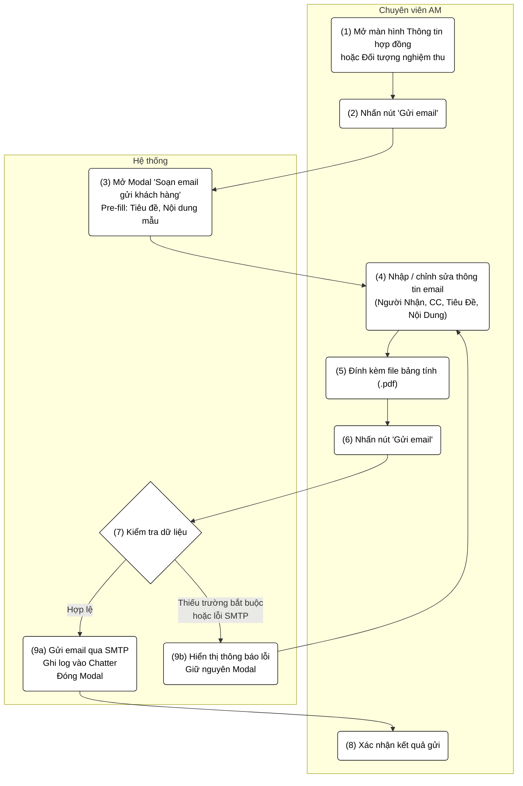
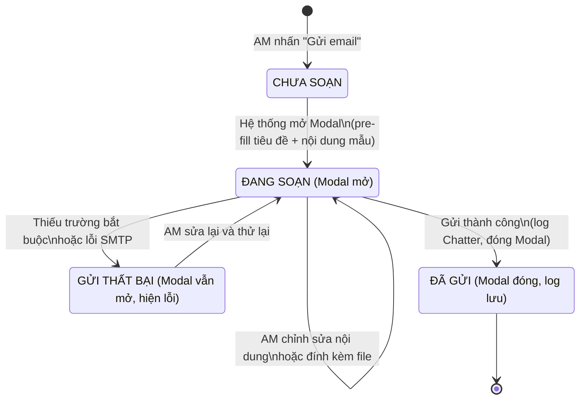

# PRD: Gửi Email KPI/SLA/Khối Lượng Công Việc Cho Khách Hàng

> **Mục đích:** Đặc tả luồng nghiệp vụ và giao diện cho tính năng soạn và gửi email đính kèm bảng tính dự kiến (KPI/SLA/Khối lượng công việc) tới khách hàng, được khởi phát từ màn hình Thông tin hợp đồng hoặc Đối tượng nghiệm thu.

---

## 1. Requirement Details

| Trường Thông Tin | Nội Dung |
| :--- | :--- |
| **Mục Đích** | Cho phép Chuyên viên AM soạn và gửi email kèm file bảng tính dự kiến (KPI/SLA/Khối lượng công việc) tới khách hàng trực tiếp từ hệ thống, phục vụ quy trình thông báo và xác nhận thông tin hợp đồng/nghiệm thu định kỳ. |
| **Tác Nhân** | Chuyên viên AM (Người dùng nội bộ). |
| **Điều Kiện Khởi Phát** | AM nhấn nút **"Gửi email"** tại màn hình **Thông tin hợp đồng** hoặc **Đối tượng nghiệm thu**. |
| **Tiền Điều Kiện** | Hợp đồng/Phiếu nghiệm thu đang ở trạng thái hợp lệ (không bị khóa). Dữ liệu KPI/SLA/Khối lượng công việc đã được nhập đầy đủ. |
| **Hậu Điều Kiện** | Email được gửi thành công tới địa chỉ người nhận và CC. Hệ thống ghi nhận lịch sử gửi email vào Chatter/timeline của hợp đồng/phiếu nghiệm thu. Modal đóng lại sau khi gửi thành công. |

---

## 2. Sơ đồ tương tác (Activity Diagram)

### State Diagram (Trạng thái gửi email)

---

## 3. Quy Tắc Nghiệp Vụ (Business Rules)

| Bước | Mã Quy Tắc | Mô Tả |
| :--- | :--- | :--- |
| 3 | BR 1 | Khi Modal mở, hệ thống tự động pre-fill **Tiêu Đề Email** theo template: `[xERP] Gửi hợp đồng dịch vụ - <Tên công ty khách hàng>`. AM được phép chỉnh sửa. |
| 3 | BR 2 | Khi Modal mở, hệ thống tự động pre-fill **Nội Dung Email** bằng template mặc định (thư ngỏ gửi khách hàng, yêu cầu xem file đính kèm và phản hồi). AM được phép chỉnh sửa tự do. |
| 4 | BR 3 | Trường **Người Nhận** và **CC** bắt buộc phải nhập. Hệ thống validate định dạng email hợp lệ trước khi gửi. Nếu nhập nhiều địa chỉ, phân tách bằng dấu phẩy (`,`). |
| 5 | BR 4 | Trường **File Đính Kèm** chỉ chấp nhận định dạng `.pdf`. AM có thể upload bằng cách kéo-thả (drag & drop) hoặc nhấn **"Choose file"**. Cho phép đính kèm nhiều file. |
| 5 | BR 5 | File đã đính kèm hiển thị dưới vùng upload dưới dạng tag (`tên_file.pdf ✕`). AM có thể gỡ bỏ từng file bằng cách nhấn `✕` tương ứng. |
| 7 | BR 6 | Trước khi gửi, hệ thống kiểm tra: **Người Nhận**, **CC**, **Tiêu Đề Email** đều phải có giá trị. Nếu thiếu bất kỳ trường nào, hiển thị thông báo lỗi inline và **không** đóng Modal. |
| 7 | BR 7 | Nhấn **"Hủy"** hoặc nút `✕` ở bất kỳ thời điểm nào sẽ đóng Modal ngay lập tức mà **không** lưu hay gửi bất kỳ dữ liệu nào. |
| 9a | BR 8 | Sau khi gửi thành công, hệ thống ghi nhận một bản ghi vào **Chatter/Timeline** của hợp đồng/phiếu nghiệm thu, bao gồm: thời điểm gửi, người gửi, danh sách người nhận, tiêu đề email, tên file đính kèm. |

---

## 4. Mô tả màn hình (UI/UX Layout)

| # | Tên | Loại Control | Chỉnh Sửa | Bắt Buộc | Giá Trị Mặc Định | Mô Tả |
| :--- | :--- | :--- | :--- | :--- | :--- | :--- |
| 1 | Tiêu đề Modal | Label | No | — | `Soạn email gửi khách hàng` | Tiêu đề cố định hiển thị đầu modal. |
| 2 | Nút đóng (`✕`) | Button | Yes | — | — | Đóng modal ngay lập tức, không lưu hay gửi bất kỳ dữ liệu nào. |
| 3 | Người Nhận | Input Text | Yes | Yes | *(trống)* | Địa chỉ email của người nhận chính. Hỗ trợ nhiều địa chỉ phân tách bằng dấu phẩy. Validate định dạng email. |
| 4 | CC | Input Text | Yes | Yes | *(trống)* | Địa chỉ email nhận bản sao. Hỗ trợ nhiều địa chỉ phân tách bằng dấu phẩy. Validate định dạng email. |
| 5 | Tiêu Đề Email | Input Text | Yes | Yes | `[xERP] Gửi hợp đồng dịch vụ - <Tên công ty KH>` | Tiêu đề email được pre-fill theo template. AM chỉnh sửa tự do. |
| 6 | Nội Dung Email | Textarea | Yes | No | Template thư ngỏ mặc định (xem BR 2) | Nội dung thân email. AM chỉnh sửa tự do. Hỗ trợ nhập nhiều đoạn văn. |
| 7 | Vùng File Đính Kèm | File Upload (Drag & Drop) | Yes | No | *(trống)* | Vùng upload file dạng viền đứt nét. Hỗ trợ kéo-thả hoặc chọn file. Chỉ chấp nhận `.pdf`. Gợi ý: `Upload file hợp đồng đã ký (.pdf)`. |
| 8 | Nút `Choose file` | Button (Secondary) | Yes | — | — | Mở hộp thoại chọn file từ máy tính. Chỉ lọc định dạng `.pdf`. |
| 9 | Tag file đã đính kèm | Tag / Chip | Yes | — | — | Hiển thị tên từng file đã đính kèm (vd: `bangtinhdukien.pdf ✕`). Nhấn `✕` để gỡ file tương ứng. |
| 10 | Nút `Hủy` | Button (Default) | Yes | — | — | Đóng modal, hủy toàn bộ nội dung đang soạn, không gửi email. |
| 11 | Nút `Gửi email` | Button (Primary — Đỏ) | Yes | — | — | Kích hoạt luồng kiểm tra dữ liệu và gửi email. Disabled khi đang xử lý gửi. |
