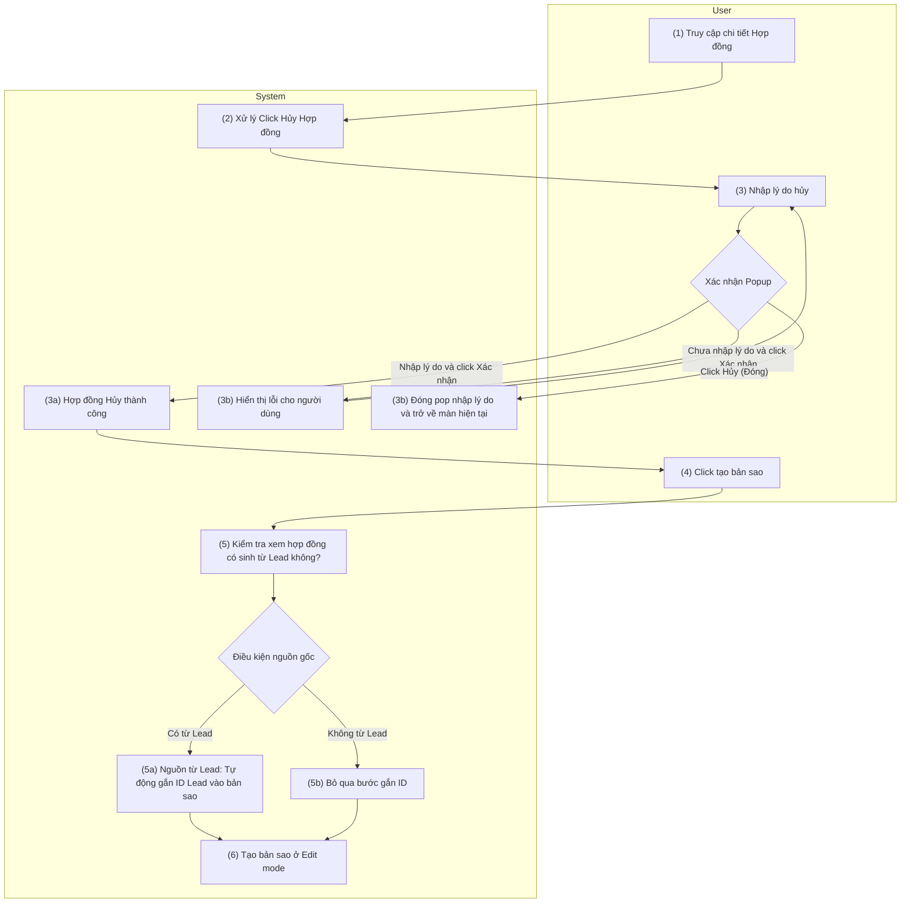

# PRD: Hủy và Nhân Bản Hợp Đồng (Cancel & Duplicate Contract)

> **Mục đích:** Đặc tả luồng xử lý khi một hợp đồng bị hủy và quy trình tái tạo lại hợp đồng mới (bản sao) để tiếp tục quy trình bán hàng, đảm bảo tính toàn vẹn dữ liệu cho cả trường hợp hợp đồng đi từ Lead và hợp đồng độc lập.

## 1. Requirement Details

| Tiêu chí | Mô tả |
| :--- | :--- |
| **Mục Đích** | Cho phép người dùng hủy một hợp đồng sai sót với lý do bắt buộc, sau đó dễ dàng tạo lại bản sao (nhân bản) để làm lại mà không mất công nhập liệu từ đầu. |
| **Tác Nhân** | Nhân viên Kinh doanh (Sales), Quản trị viên |
| **Tiền Điều Kiện** | Hợp đồng đang ở trạng thái cho phép hủy. |
| **Hậu Điều Kiện** | Hợp đồng cũ chuyển sang trạng thái "Đã hủy" kèm lý do. Hệ thống tạo một hợp đồng mới (bản sao) ở trạng thái "Nháp", kế thừa toàn bộ thông tin và mở sẵn ở Edit mode. Nếu bản gốc link với Lead, bản sao cũng tự động link với Lead đó. |

## 2. Sơ đồ tương tác (Activity Diagram - Swimlane)

## 3. Quy Tắc Nghiệp Vụ (Business Rules)

Dựa theo sơ đồ quy trình, các quy tắc nghiệp vụ hệ thống cần tuân thủ bao gồm:

| Bước | Mã Quy Tắc | Mô Tả |
| :---: | :---: | :--- |
| (2) - (3) | **BR 1** | **Hiển thị Popup Hủy:** Khi người dùng click nút "Hủy hợp đồng" ở màn hình chi tiết, hệ thống phải mở một Popup bắt buộc người dùng "Nhập lý do hủy" trước khi tiến hành hủy thực sự. |
| (3a) - (3b) | **BR 2** | **Xác thực Lý do hủy (Validation):** - Nếu người dùng **Chưa nhập lý do** mà bấm "Xác nhận", hệ thống hiển thị thông báo lỗi (inline error) yêu cầu điền đầy đủ thông tin (3b). - Nếu người dùng bấm "Hủy" trên popup, hệ thống đóng cửa sổ, hủy thao tác và giữ nguyên trạng thái hợp đồng (3b). - Nếu nhập đầy đủ và "Xác nhận", hệ thống ghi nhận Hủy hợp đồng thành công (3a), khóa bản ghi (Read-only) và lưu vết lý do hủy. |
| (4) | **BR 3** | **Điều kiện Tạo bản sao:** Nút thao tác "Tạo bản sao" chỉ được phép hiển thị/khả dụng trên các Hợp đồng đang ở trạng thái "Đã hủy". |
| (5) - (5b) | **BR 4** | **Kế thừa dữ liệu Lead:** Khi khởi tạo bản sao, hệ thống rà soát trường `lead_id` của hợp đồng cũ. Nếu tồn tại, hệ thống tự động copy (gắn) ID Lead này sang bản sao mới (5a) để đảm bảo không đứt gãy phễu kinh doanh. Nếu không có, bỏ qua bước này (5b). |
| (6) | **BR 5** | **Khởi tạo và Điều hướng (Edit Mode):** Bản sao mới được tạo ra sẽ sao chép toàn bộ thông tin (sản phẩm, khách hàng, đơn giá), mặc định gán trạng thái là "Nháp". Sau khi sinh bản ghi thành công, hệ thống tự động redirect (chuyển hướng) người dùng thẳng vào giao diện của bản sao mới này **ở chế độ Edit mode** để có thể sửa và lưu ngay lập tức. |

## 4. Mô tả màn hình (UI/UX Layout) - Popup Hủy Hợp Đồng

Dưới đây là đặc tả giao diện của Popup xác nhận khi người dùng thao tác bấm nút "Hủy hợp đồng".

| # | Tên | Loại Control | Chỉnh Sửa | Bắt Buộc | Giá Trị Mặc Định | Mô Tả |
| :--- | :--- | :--- | :--- | :--- | :--- | :--- |
| 1 | Tiêu đề Popup | Text/Title | No | N/A | Xác nhận hủy hợp đồng | Dòng tiêu đề hiển thị to, rõ ràng ở Header của Popup. |
| 2 | Icon cảnh báo | Icon | No | N/A | N/A | Nằm cạnh tiêu đề hoặc nội dung. Là icon dấu chấm than tam giác màu Cam hoặc Đỏ để báo hiệu hành động phá hủy dữ liệu (Destructive action). |
| 3 | Lời nhắc | Text | No | N/A | Bạn có chắc chắn... | Dòng thông báo hệ quả: *"Bạn có chắc chắn muốn hủy hợp đồng này? Hợp đồng sau khi hủy sẽ bị khóa và không thể hoàn tác."* |
| 4 | Lý do hủy | Textarea | Yes | Yes | (Bỏ trống) | Khối nhập liệu đa dòng (Multiline) để điền lý do. Placeholder: *"Vui lòng nhập lý do hủy hợp đồng..."*. Hiển thị lỗi viền đỏ (Inline Error) nếu để trống mà bấm Xác nhận. |
| 5 | Nút Đóng / Hủy bỏ | Button (Secondary) | Yes | N/A | N/A | Nút viền nhạt. Click để đóng Popup và hủy bỏ thao tác (tuân theo BR 2). |
| 6 | Nút Xác nhận | Button (Primary/Danger) | Yes | N/A | N/A | Nút có màu Đỏ để nhấn mạnh rủi ro. Bấm vào để kích hoạt việc kiểm tra lỗi (validate) và gửi lệnh Hủy. |
