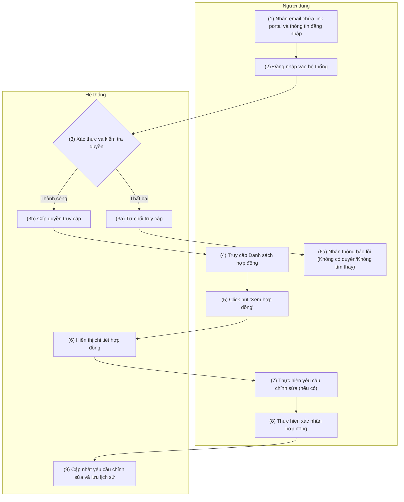

# PRD: Portal Khách Hàng - Quản Lý Hợp Đồng

> **Mục đích:** Đặc tả luồng nghiệp vụ và giao diện cho tính năng Quản lý Danh sách hợp đồng và Xem chi tiết/Xác nhận hợp đồng trên hệ thống Portal Khách hàng (XERP).

## 1. Requirement Details

| Tiêu chí | Mô tả |
| :--- | :--- |
| **Mục Đích** | Cho phép khách hàng đăng nhập vào Portal để xem danh sách hợp đồng, theo dõi trạng thái, và thực hiện xem xét, xác nhận hoặc yêu cầu chỉnh sửa nội dung hợp đồng. |
| **Tác Nhân** | Khách hàng (End-user có tài khoản truy cập Portal) |
| **Điều Kiện Khởi Phát** | Khách hàng nhận được email thông báo có hợp đồng mới và đăng nhập vào hệ thống để kiểm tra. |
| **Tiền Điều Kiện** | Người dùng đã nhận email chứa link portal và thông tin đăng nhập. Đăng nhập thành công và có quyền truy cập module Hợp đồng. |
| **Hậu Điều Kiện** | Hệ thống hiển thị danh sách hợp đồng của khách hàng. Khi tương tác, hệ thống điều hướng đến chi tiết, lưu vết trạng thái phê duyệt/chỉnh sửa vào cơ sở dữ liệu. |

## 2. Sơ đồ tương tác (Activity Diagram - Swimlane)

## 3. Quy Tắc Nghiệp Vụ (Business Rules)

| Bước | Mã Quy Tắc | Mô Tả |
| :---: | :---: | :--- |
| (1) | **BR 1** | **Gửi thông báo Email:** Hệ thống phải tự động gửi email chứa đường link (URL) dẫn trực tiếp đến portal kèm theo thông tin đăng nhập cơ bản cho người dùng khi có hợp đồng mới cần xử lý. |
| (2) - (3) | **BR 2** | **Xác thực và Phân quyền (Authentication & Authorization):** Khi người dùng tiến hành đăng nhập tại bước (2), hệ thống thực hiện kiểm tra (3). Nếu tài khoản sai hoặc không có quyền ➔ Hệ thống từ chối và hiển thị Popup/Inline Error theo chuẩn *Common_Business_Rules*. Nếu hợp lệ ➔ Cấp quyền truy cập. |
| (4) - (6) | **BR 3** | **Truy cập Dữ liệu Hợp đồng:** Tại màn hình danh sách và chi tiết, dữ liệu trả về phải được filter (lọc) theo đúng ID Khách hàng, đảm bảo người dùng chỉ xem được các hợp đồng của chính doanh nghiệp họ. |
| (7) | **BR 4** | **Yêu cầu chỉnh sửa:** Trường hợp người dùng có thắc mắc hoặc cần sửa đổi nội dung hợp đồng, hệ thống hiển thị Form nhập "Nội dung yêu cầu". Trường này là **Bắt buộc nhập** nếu người dùng gửi yêu cầu chỉnh sửa. |
| (8) - (9) | **BR 5** | **Kiểm soát xung đột (Concurrency):** Trước khi cập nhật yêu cầu chỉnh sửa hoặc xác nhận, hệ thống bắt buộc kiểm tra Tiền điều kiện (Timestamp) từ DB để tránh xung đột thao tác nếu có Account khác của cùng công ty đang sửa (Tham chiếu Mục 6 - *Common_Business_Rules*). |
| (9) | **BR 6** | **Cập nhật và Lưu vết (Audit Log):** Mọi hành động "Yêu cầu chỉnh sửa" hoặc "Xác nhận hợp đồng" khi thành công đều cập nhật trạng thái hợp đồng tương ứng, và tự động sinh ra log ghi nhận thời gian, người thao tác vào lịch sử hoạt động (Chatter). |

## 4. Mô tả màn hình (UI/UX Layout) - Màn hình Danh sách hợp đồng

| # | Tên | Loại Control | Chỉnh Sửa | Bắt Buộc | Giá Trị Mặc Định | Mô Tả |
| :--- | :--- | :--- | :--- | :--- | :--- | :--- |
| 1 | Menu điều hướng (Sidebar) | Menu | No | N/A | Danh sách hợp đồng | Khối bên trái. Mục "Danh sách hợp đồng" (cùng icon) được highlight nền đỏ chữ đỏ để báo hiệu đang Active. |
| 2 | Top Navigation | Header | Yes | N/A | N/A | Thanh trên cùng gồm: Tìm kiếm toàn cục, Chuông Thông báo, icon Hỗ trợ (?), Avatar của Khách hàng. |
| 3 | KPI Cards (Thống kê) | Widget | No | N/A | Số liệu thực tế | 4 block thống kê hiển thị nổi bật ở trên: Chờ xác nhận, Hiệu lực, Đã duyệt, Trình ký, kèm con số lớn đại diện cho số lượng bản ghi. |
| 4 | Tìm kiếm danh sách | Input Text | Yes | No | Ô trống (Placeholder: Tìm kiếm...) | Ô nhập từ khóa tìm kiếm (lọc theo Mã HĐ, Tên HĐ...). Nằm phía trên bảng dữ liệu. |
| 5 | Xuất Excel | Button (Secondary) | Yes | N/A | N/A | Button nền trắng, viền đỏ, chữ đỏ kèm icon Tải xuống. Nhấn để tải dữ liệu danh sách dưới dạng Excel. Chịu ràng buộc giới hạn 5000 dòng theo *Common_Business_Rules*. |
| 6 | Bảng danh sách hợp đồng | Data Table | Yes | N/A | N/A | Bảng hiển thị thông tin. Bao gồm các cột: `[Checkbox]`, `Mã hợp đồng`, `Tên hợp đồng`, `Ngày gửi`, `Giá trị`, `Trạng thái`, `Hành động`. |
| 7 | Icon Lọc & Sắp xếp | Sort/Filter | Yes | N/A | N/A | Kế bên tiêu đề mỗi cột có cặp icon tam giác lên/xuống (Sort) và hình phễu (Filter) để thao tác xem dữ liệu trực tiếp. |
| 8 | Cột Trạng thái | Badge / Label | No | N/A | Trạng thái hiện tại | Hiển thị dạng nhãn màu sắc để dễ phân biệt (VD: Chờ xác thực - xanh lam, Chờ ký - vàng, Hiệu lực - xanh ngọc, Hủy - đỏ). |
| 9 | Nút Xem hợp đồng | Button (Row Action) | Yes | N/A | N/A | Nằm ở cột Hành động cuối mỗi dòng. Chứa text "Xem hợp đồng" kèm icon Con mắt. Dùng để click vào chuyển hướng sang màn hình Chi tiết (Trigger luồng). |
| 10 | Phân trang (Pagination) | Pagination | Yes | N/A | 10 dòng/trang | Nằm dưới cùng bảng. Hiển thị text "Hiển thị 1-10 trong số X", kèm nút điều hướng mũi tên trái/phải màu đỏ nổi bật. |

## 5. Mô tả màn hình (UI/UX Layout) - Màn hình Chi tiết hợp đồng

Dưới đây là đặc tả cho phần tử Block **Thông tin sản phẩm dịch vụ** bên trong giao diện Xem chi tiết hợp đồng.

| # | Tên | Loại Control | Chỉnh Sửa | Bắt Buộc | Giá Trị Mặc Định | Mô Tả |
| :--- | :--- | :--- | :--- | :--- | :--- | :--- |
| 1 | Header Khối Sản phẩm | Accordion | Yes | N/A | Mở (Expanded) | Tiêu đề "Thông tin sản phẩm dịch vụ". Góc phải có icon mũi tên cho phép người dùng tương tác thu gọn/mở rộng khối nội dung này. |
| 2 | Bảng hiển thị sản phẩm | Data Table | No (Read-only) | N/A | N/A | Bảng hiển thị danh sách sản phẩm. Các tiêu đề cột có gắn icon Sắp xếp (Sort) và Lọc (Filter) để hỗ trợ tra cứu. Khách hàng **không được phép sửa trực tiếp** dữ liệu ở đây. |
| 3 | Loại dự án | Text/Label | No | N/A | Lấy từ DB | Nằm trong bảng. Hiển thị phân loại dự án (Level 1). Chỉ xem (Read-only). |
| 4 | Nhóm dịch vụ | Text/Label | No | N/A | Lấy từ DB | Nằm trong bảng. Hiển thị nhóm dịch vụ (Level 2). Chỉ xem (Read-only). |
| 5 | Tên dịch vụ | Text/Label | No | N/A | Lấy từ DB | Nằm trong bảng. Hiển thị sản phẩm/dịch vụ cụ thể (Level 3). Chỉ xem (Read-only). |
| 6 | Tổng trước thuế | Text/Label | No | N/A | Tự tính | Nằm dưới góc phải. Hiển thị tổng tiền trước thuế. Số liệu màu đỏ đậm, theo định dạng tiền tệ VND. |
| 7 | Tổng VAT | Text/Label | No | N/A | Tự tính | Dòng hiển thị tổng tiền thuế GTGT. Số liệu màu đỏ đậm, định dạng VND. |
| 8 | Tổng Sau thuế | Text/Label | No | N/A | Tự tính | Dòng hiển thị tổng tiền thanh toán (Tổng trước thuế + VAT). Số liệu màu đỏ đậm, định dạng VND. |
