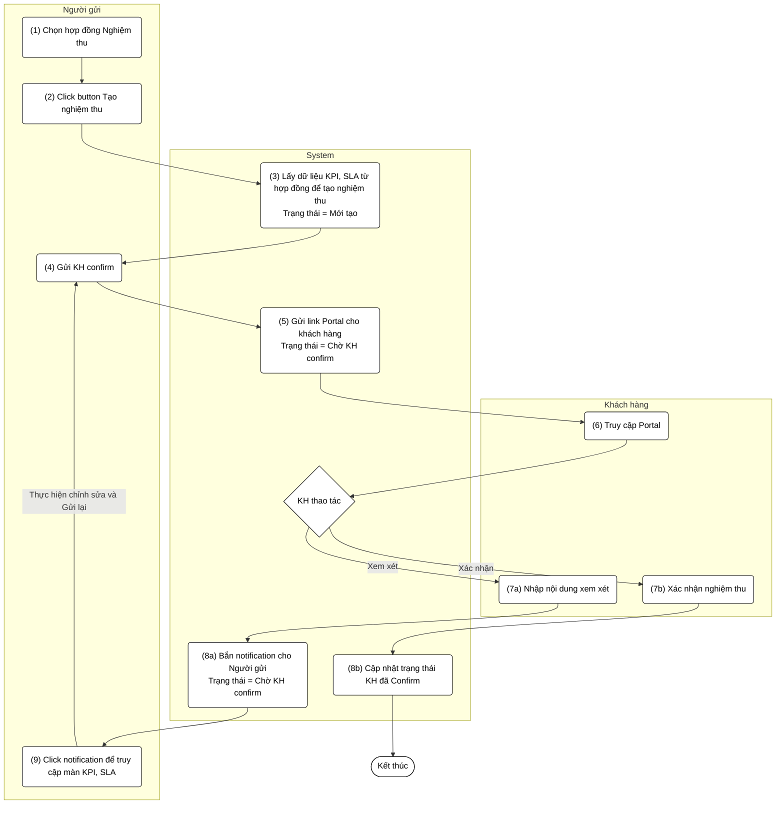
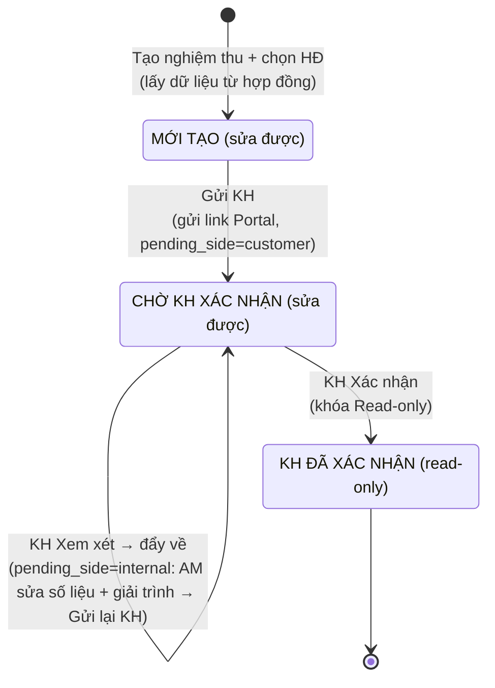

# PRD: Tạo nghiệm thu KPI/SLA (đồng bộ dữ liệu từ Hợp đồng)

> **Mục đích:** Đặc tả luồng nghiệp vụ và giao diện cho tính năng tạo phiếu nghiệm thu KPI/SLA, trong đó dữ liệu chỉ tiêu được đồng bộ từ Hợp đồng gốc, gửi khách hàng xác nhận qua Portal và quản lý trạng thái phiếu nghiệm thu.

## 1. Requirement Details

| Trường Thông Tin | Nội Dung |
| :--- | :--- |
| **Mục Đích** | Khởi tạo phiếu nghiệm thu KPI/SLA dựa trên cấu hình chỉ tiêu đã ký kết trong Hợp đồng, phục vụ đánh giá chất lượng dịch vụ định kỳ và lấy xác nhận của khách hàng. |
| **Tác Nhân** | Chuyên viên AM (Người dùng nội bộ); Khách hàng (qua Portal). |
| **Điều Kiện Khởi Phát** | AM thực hiện nghiệm thu chất lượng dịch vụ theo kỳ cho một hợp đồng đang hiệu lực. |
| **Tiền Điều Kiện** | Hợp đồng gốc ở trạng thái "Hiệu lực" và đã có cấu hình KPI/SLA (chỉ tiêu, ngưỡng, tỷ trọng). |
| **Hậu Điều Kiện** | Sinh ra một phiếu nghiệm thu KPI/SLA liên kết hợp đồng, trạng thái khởi tạo "Mới tạo"; sau khi khách hàng xác nhận chuyển trạng thái "KH đã confirm". |

## 2. Sơ đồ tương tác (Activity Diagram)

### State Diagram (Trạng thái khối KPI/SLA)

## 3. Quy Tắc Nghiệp Vụ (Business Rules)

| Bước | Mã Quy Tắc | Mô Tả |
| :--- | :--- | :--- |
| 1 | BR 1 | Dropdown "Hợp đồng nghiệm thu" chỉ hiển thị hợp đồng trạng thái `Hiệu lực` và đã có cấu hình KPI/SLA. |
| 3 | BR 2 | Khi tạo nghiệm thu, hệ thống tự động đồng bộ toàn bộ cấu hình KPI, SLA từ hợp đồng (cây chỉ tiêu, ngưỡng đạt, tỷ trọng, ngưỡng trừ phí). Trạng thái = `Mới tạo`. Khối KPI/SLA cho phép chỉnh sửa. |
| 4 | BR 3 | Người dùng nhập "Điểm đạt"/"Ghi chú" cho từng chỉ tiêu; hệ thống tính Tổng điểm đạt theo tỷ trọng và áp ngưỡng trừ phí. Trước khi "Gửi KH confirm", tất cả chỉ tiêu bắt buộc có "Điểm đạt". |
| 5 | BR 4 | Khi gửi confirm: hệ thống gửi link Portal + email cho KH, chuyển trạng thái = `Chờ KH confirm`. Đặt cờ `pending_side = customer` → **ẩn** nút "Gửi KH confirm". Khối KPI/SLA **vẫn cho phép sửa** (không khóa). |
| 6, 7 | BR 5 | Tại Portal, KH có 2 lựa chọn: **Xem xét** hoặc **Xác nhận** (không có "Từ chối"). |
| 7a | BR 6 | KH "Xem xét": bắt buộc hiển thị popup nhập **nội dung xem xét** (`review_comment`). Sau khi gửi, trạng thái **vẫn là** `Chờ KH confirm`. |
| 8a | BR 7 | Hệ thống bắn notification cho Người gửi, lưu `review_comment`, tăng `review_round` (ghi Chatter), đặt cờ `pending_side = internal` → **hiện** nút "Gửi KH confirm". Không có nút Thu hồi. |
| 9, 4 | BR 8 | Người gửi vào phiếu (qua notification): được **chỉnh sửa số liệu KPI/SLA** + **nhập giải trình** (`am_response`), rồi bấm "Gửi KH confirm" để gửi lại Portal (reset `pending_side = customer`). Lặp đến khi KH Xác nhận. |
| 7b, 8b | BR 9 | KH "Xác nhận": trạng thái chuyển = `KH đã Confirm`; hệ thống ghi nhận thời điểm + người xác nhận; khóa toàn bộ phiếu ở chế độ **Read-only**. |

## 4. Mô tả màn hình (UI/UX Layout)

| # | Tên | Loại Control | Chỉnh Sửa | Bắt Buộc | Giá Trị Mặc Định | Mô Tả |
| :--- | :--- | :--- | :--- | :--- | :--- | :--- |
| 1 | Tabs chuyển đổi KPI / SLA | Tab Menu | Yes | N/A | N/A | Nút chuyển đổi qua lại giữa màn hình nhập liệu KPI và SLA. |
| 2 | Xuất Excel | Button | Yes | N/A | N/A | Xuất dữ liệu nghiệm thu ra file Excel gồm 2 sheet (KPI và SLA). |
| 3 | Block Tổng điểm KPI | Form Inputs | Conditional | No | Theo HĐ | Các ô nhập liệu rời: Điểm chuẩn, Tỷ trọng, Điểm đạt, Ghi chú. Read-only khi `KH ĐÃ CONFIRM`. |
| 4 | Bảng Cây chỉ tiêu KPI | Data Table (2 cấp) | Conditional | Yes | Đồng bộ từ HĐ | Gồm Nhóm (level 1) + Chỉ tiêu (level 2). Các cột: STT, Nội dung đánh giá, Diễn giải, KPIs yêu cầu, Cách tính, Điểm chuẩn, KPIs đạt, Điểm, Ghi chú. Cho phép thêm/xóa dòng. Read-only khi `KH ĐÃ CONFIRM`. |
| 5 | Block Tổng điểm SLA | Form Inputs | Conditional | No | Theo HĐ | Gồm ô Điểm chuẩn, Tỷ trọng, Điểm đạt, Ghi chú và **Danh sách mức ngưỡng** (Editable rows độc lập). Read-only khi `KH ĐÃ CONFIRM`. |
| 6 | Bảng Cây chỉ tiêu SLA | Data Table (2 cấp) | Conditional | Yes | Đồng bộ từ HĐ | Gồm Nhóm (level 1) + Chỉ tiêu (level 2). Các cột: TT, Tên chỉ tiêu, Yêu cầu, PP Xác định, Ngưỡng, Tỷ trọng, Điểm đạt, Ghi chú. Cho phép thêm/xóa dòng. Read-only khi `KH ĐÃ CONFIRM`. |
| 7 | Nút "Gửi KH" | Button | Conditional | N/A | N/A | Hiện khi: trạng thái `MỚI TẠO`, hoặc `CHỜ KH XÁC NHẬN` với `pending_side = internal` (KH đã Xem xét đẩy về). Ẩn khi `pending_side = customer` (đang chờ KH) và khi `KH ĐÃ XÁC NHẬN`. |
| 8 | Trạng thái phiếu | Status Bar / Label | No | N/A | Mới tạo | Hiển thị: Mới tạo / Chờ KH xác nhận / KH đã xác nhận. |
| 9 | Popup Ý kiến xem xét | Custom Modal Dialog | Yes | Yes | N/A | Hiển thị phía Portal khi KH bấm "Xem xét"; bắt buộc nhập `review_comment`. Overlay làm mờ (backdrop-blur), không dùng `alert()`. |
| 10 | Ô Giải trình của AM | Textarea | Conditional | No | N/A | AM nhập `am_response` phản hồi ý kiến KH khi phiếu bị đẩy về (pending_side = internal). |
| 11 | Khung Chatter / Lịch sử | Split Pane | No | N/A | N/A | Timeline dọc ghi các vòng xem xét (`review_round`): thời điểm, người, ý kiến KH, giải trình AM, đổi trạng thái. |

## 5. Bảng Mapping Field SLA

Dưới đây là bảng ánh xạ các trường dữ liệu SLA giữa hệ thống và file báo cáo Excel (phục vụ chức năng Import/Export):

| Mục | Nhãn (Label) | Field key | Kiểu nhập | Giá trị mặc định / Gợi ý | Nguồn Excel | Ánh xạ (1 chiều: doc -> field) |
| :--- | :--- | :--- | :--- | :--- | :--- | :--- |
| D.1 Thông tin chung | Loại SLA | sla_category | dropdown | CSKH / GP&DVKT / XD | Tên sheet | Chọn tay |
| D.1 Thông tin chung | Tên phụ lục | sla_title | text | CHỈ TIÊU SLA ĐÁNH GIÁ CHẤT LƯỢNG... | R0C0 | ✓ |
| D.1 Thông tin chung | Số biên bản nghiệm thu | sla_acceptance_no | text | | R0C0 | ✓ |
| D.1 Thông tin chung | Ngày nghiệm thu | sla_acceptance_date | date (DD/MM/YYYY) | | R0C0 | ✓ |
| D.1 Thông tin chung | Điểm tối đa | sla_max_score | number | 100 | R2c4 | ✓ |
| D.1 Thông tin chung | Tổng điểm đạt | sla_total_score | number | | R2c6 | Nghiệm thu |
| D.2 Ngưỡng trừ phí | Ngưỡng 95-100 điểm | sla_penalty_95_100 | text | Không trừ phí | R2c4 | ✓ |
| D.2 Ngưỡng trừ phí | Ngưỡng 90-<95 điểm | sla_penalty_90_95 | text | Trừ 0.2% phí thanh toán/01 điểm dưới ngưỡng 95 | R2c4 | ✓ |
| D.2 Ngưỡng trừ phí | Ngưỡng 80-<90 điểm | sla_penalty_80_90 | text | Trừ 0.3% chi phí thanh toán/01 điểm dưới ngưỡng 95 | R2c4 | ✓ |
| D.2 Ngưỡng trừ phí | Ngưỡng 70-<80 điểm | sla_penalty_70_80 | text | Trừ 0.5% chi phí thanh toán/01 điểm dưới ngưỡng 95 | R2c4 | ✓ |
| D.2 Ngưỡng trừ phí | Ngưỡng 65-<70 điểm | sla_penalty_65_70 | text | Trừ 1% chi phí thanh toán/01 điểm dưới ngưỡng 95 | R2c4 | ✓ |
| D.2 Ngưỡng trừ phí | Dưới 65 điểm | sla_penalty_below_65 | text | Trừ 8% chi phí thanh toán/hợp đồng | R2c4 | ✓ |
| D.3 Nhóm A | Tên nhóm A | sla_A_name | text | ĐẢM BẢO CÁC CHỈ TIÊU KPI VỀ CHẤT LƯỢNG PHỤC VỤ KHÁCH HÀNG | R3c1 | ✓ |
| D.3 Nhóm A | Quỹ điểm nhóm A | sla_A_quota | number | 70 | R3c4 | ✓ |
| D.3 Nhóm A | Tỷ trọng nhóm A | sla_A_weight | number/% | 0.7 | R3c5 | ✓ |
| D.3 Nhóm A | A.1 – Tên chỉ tiêu | sla_A1_name | text | Số lượng các chỉ tiêu KPI đạt trong kỳ đánh giá | R4c1 | ✓ |
| D.3 Nhóm A | A.1 – Yêu cầu | sla_A1_requirement | textarea | VCX tổ chức thực hiện, điều hành đảm bảo các KPI về CLPV theo phụ lục | R4c2 | ✓ |
| D.3 Nhóm A | A.1 – Phương pháp xác định | sla_A1_method | textarea | Số chỉ tiêu KPI đạt / tổng số KPI đánh giá trong tháng | R4c3 | ✓ |
| D.3 Nhóm A | A.1 – Ngưỡng đạt | sla_A1_target | textarea | KPI đạt ≥95% => 100% Quỹ điểm; 85-95% => 80%; 75-85% => 70%; 65-75% | R4c4 | ✓ |
| D.3 Nhóm A | A.1 – Điểm đạt | sla_A1_score | number | | R4c6 | Nghiệm thu |
| D.3 Nhóm A | A.1 – Ghi chú | sla_A1_note | text | | R4c7 | Nghiệm thu |
| D.4 Nhóm B | Tên nhóm B | sla_B_name | text | CAM KẾT VỀ BẢO MẬT THÔNG TIN, CƠ SỞ DỮ LIỆU KHÁCH HÀNG | R5c1 | ✓ |
| D.4 Nhóm B | Quỹ điểm nhóm B | sla_B_quota | number | 20 | R5c4 | ✓ |
| D.4 Nhóm B | Tỷ trọng nhóm B | sla_B_weight | number/% | 0.2 | R5c5 | ✓ |
| D.4 Nhóm B | B.1 – Tên chỉ tiêu | sla_B1_name | text | Bảo mật về thông tin, cơ sở dữ liệu của VCC | R6c1 | ✓ |
| D.4 Nhóm B | B.1 – Yêu cầu | sla_B1_requirement | textarea | VCX cam kết bảo mật tài liệu SPDV, CSDL KH; không dùng ngoài phạm vi t | R6c2 | ✓ |
| D.4 Nhóm B | B.1 – Phương pháp xác định | sla_B1_method | textarea | Theo thực tế phát sinh | R6c3 | ✓ |
| D.4 Nhóm B | B.1 – Ngưỡng đạt | sla_B1_target | textarea | Không vi phạm => 100% quỹ điểm; Trừ 0,5 điểm/1 lần vi phạm | R6c4 | ✓ |
| D.4 Nhóm B | B.1 – Điểm đạt | sla_B1_score | number | | R6c6 | Nghiệm thu |
| D.4 Nhóm B | B.1 – Ghi chú | sla_B1_note | text | | R6c7 | Nghiệm thu |
| D.5 Nhóm C | Tên nhóm C | sla_C_name | text | CÔNG TÁC PHỐI HỢP GIỮA VCX VÀ VCC | R7c1 | ✓ |
| D.5 Nhóm C | Quỹ điểm nhóm C | sla_C_quota | number | 10 | R7c4 | ✓ |
| D.5 Nhóm C | Tỷ trọng nhóm C | sla_C_weight | number/% | 0.1 | R7c5 | ✓ |
| D.5 Nhóm C | C.1 – Tên chỉ tiêu | sla_C1_name | text | Thông báo kịp thời khi có sự cố phát sinh | R8c1 | ✓ |
| D.5 Nhóm C | C.1 – Yêu cầu | sla_C1_requirement | textarea | Thông báo cho đầu mối CSKH trong 30 phút; Hotline 18009377 / Zalo DV | R8c2 | ✓ |
| D.5 Nhóm C | C.1 – Ngưỡng đạt | sla_C1_target | textarea | Trừ 01 điểm/1 lần vi phạm thông báo sự cố | R8c4 | ✓ |
| D.5 Nhóm C | C.1 – Điểm đạt | sla_C1_score | number | | R8c6 | Nghiệm thu |
| D.5 Nhóm C | C.1 – Ghi chú | sla_C1_note | text | | R8c7 | Nghiệm thu |
| D.5 Nhóm C | C.2 – Tên chỉ tiêu | sla_C2_name | text | Báo cáo chất lượng giải đáp Tổng đài theo tuần/tháng | R9c1 | ✓ |
| D.5 Nhóm C | C.2 – Yêu cầu | sla_C2_requirement | textarea | Báo cáo tuần: trước 12h thứ 3; Báo cáo tháng: trước 12h ngày 03 tháng | R9c2 | ✓ |
| D.5 Nhóm C | C.2 – Ngưỡng đạt | sla_C2_target | textarea | Trừ 0,1 điểm/1 lần không gửi báo cáo | R9c4 | ✓ |
| D.5 Nhóm C | C.2 – Điểm đạt | sla_C2_score | number | | R9c6 | Nghiệm thu |
| D.5 Nhóm C | C.2 – Ghi chú | sla_C2_note | text | | R9c7 | Nghiệm thu |
| D.5 Nhóm C | C.3 – Tên chỉ tiêu | sla_C3_name | text | Công tác đảm bảo seats cho CSKH | R10c1 | ✓ |
| D.5 Nhóm C | C.3 – Yêu cầu | sla_C3_requirement | textarea | Trừ 1 điểm/1% seats thiếu so với HĐ; ngày Lễ Tết: trừ 2 điểm/1 seats th | R10c2 | ✓ |
| D.5 Nhóm C | C.3 – Ngưỡng đạt | sla_C3_target | textarea | Trừ 1 điểm/1% seats thiếu; ngày Lễ Tết: trừ 2 điểm/1 seats thiếu | R10c4 | ✓ |
| D.5 Nhóm C | C.3 – Điểm đạt | sla_C3_score | number | | R10c6 | Nghiệm thu |
| D.5 Nhóm C | C.3 – Ghi chú | sla_C3_note | text | | R10c7 | Nghiệm thu |
| D.5 Nhóm C | C.4 – Tên chỉ tiêu | sla_C4_name | text | Các sự vụ/trường hợp khác | R11c1 | ✓ |
| D.5 Nhóm C | C.4 – Yêu cầu | sla_C4_requirement | textarea | Là những trường hợp phát sinh khác | R11c2 | ✓ |
| D.5 Nhóm C | C.4 – Ngưỡng đạt | sla_C4_target | textarea | Cộng/Trừ điểm theo mức độ ảnh hưởng thực tế | R11c4 | ✓ |
| D.5 Nhóm C | C.4 – Điểm đạt | sla_C4_score | number | | R11c6 | Nghiệm thu |
| D.5 Nhóm C | C.4 – Ghi chú | sla_C4_note | text | | R11c7 | Nghiệm thu |
