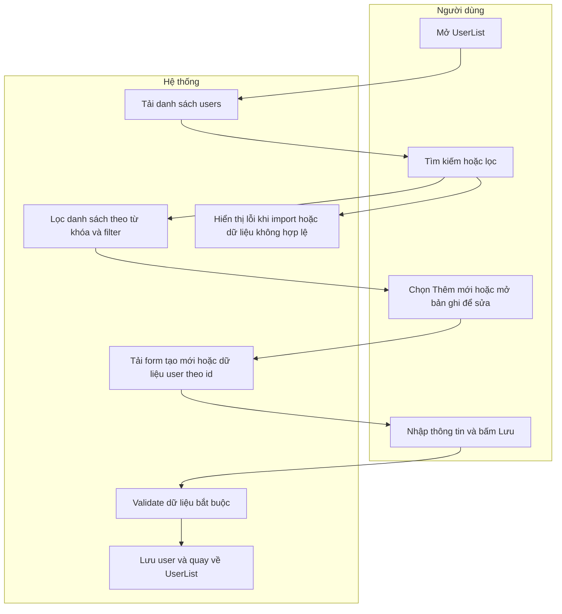
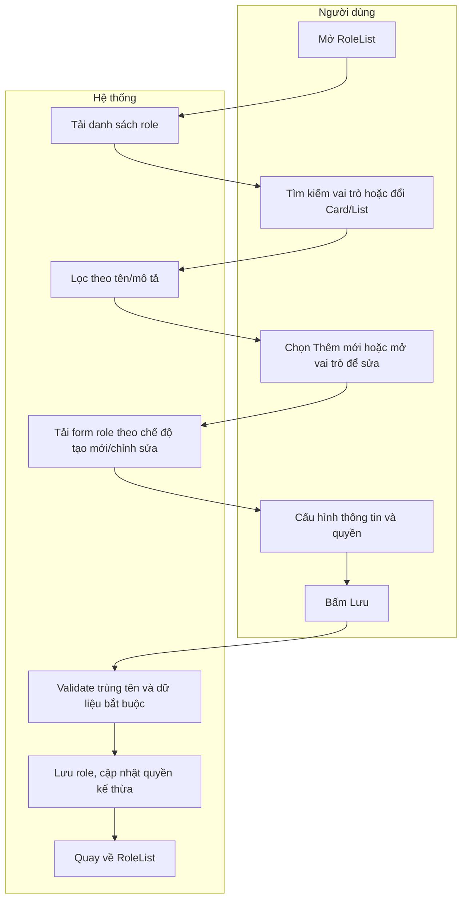

# SRS - Quản Lý Người Dùng Và Vai Trò

## 1. Phạm Vi
Tài liệu mô tả yêu cầu phần mềm cho các màn hình:
- UserList (Danh sách người dùng)
- UserForm tạo mới người dùng
- UserForm chỉnh sửa người dùng
- RoleList (Danh sách vai trò)
- RoleForm tạo mới vai trò
- RoleForm chỉnh sửa vai trò

Áp dụng cho module quản trị người dùng và phân quyền trong giao diện lite-erp-ui.

## 2. Requirement Details

| Tiêu chí | Mô tả |
|---|---|
| Mục đích | Quản lý tập trung thông tin tài khoản người dùng và vai trò hệ thống; hỗ trợ tạo mới, cập nhật, lọc, tìm kiếm, nhập/xuất dữ liệu và gán quyền chi tiết. |
| Tác nhân | Quản trị hệ thống, nhân sự phụ trách vận hành, trưởng bộ phận được cấp quyền. |
| Điều kiện khởi phát | Người dùng điều hướng đến các route quản trị User/Role. |
| Tiền điều kiện | Người dùng đã đăng nhập và có quyền truy cập chức năng quản trị user/role. |
| Hậu điều kiện | Dữ liệu User/Role được tạo hoặc cập nhật thành công; danh sách phản ánh đúng trạng thái mới nhất. |

## 3. Danh Sách Route

| Màn hình | Route |
|---|---|
| UserList | /users |
| UserForm tạo mới | /user/new |
| UserForm chỉnh sửa | /user/edit/:id |
| RoleList | /roles |
| RoleForm tạo mới | /role/new |
| RoleForm chỉnh sửa | /role/edit/:id |

## 4. Sơ Đồ Tương Tác

### 4.1 User Module (List + Create/Edit)

### 4.2 Role Module (List + Create/Edit)

## 5. Quy Tắc Nghiệp Vụ

| Mã quy tắc | Mô tả |
|---|---|
| BR-USER-01 | UserList tìm kiếm theo fullName, username, email (không phân biệt hoa thường). |
| BR-USER-02 | Filter nâng cao trên UserList áp dụng logic AND giữa các nhóm filter: role, status, department, position. |
| BR-USER-03 | Bấm vào dòng user tại UserList mở màn hình chỉnh sửa user tương ứng. |
| BR-USER-04 | Bấm trạng thái trên UserList đổi Active/Inactive ngay tại danh sách. |
| BR-USER-05 | Khi tạo/sửa user, email là bắt buộc; username được đồng bộ theo email khi submit. |
| BR-USER-06 | Trường Lý do nghỉ bị disable nếu chưa có Ngày hết hạn nghỉ. |
| BR-USER-07 | Khi import user: bắt buộc có email/username; nếu thiếu sẽ báo lỗi theo dòng. |
| BR-USER-08 | Import hỗ trợ mapping linh hoạt cho tên cột tiếng Việt/tiếng Anh (ví dụ Tên đăng nhập hoặc Username). |
| BR-ROLE-01 | RoleList tìm kiếm theo name và description (không phân biệt hoa thường). |
| BR-ROLE-02 | RoleList hỗ trợ 2 chế độ hiển thị: Card và List. |
| BR-ROLE-03 | Bấm trạng thái trên RoleList đổi Active/Inactive ngay tại danh sách. |
| BR-ROLE-04 | Tên vai trò là bắt buộc; trim trước khi validate/lưu. |
| BR-ROLE-05 | Không cho phép trùng tên vai trò (so sánh không phân biệt hoa thường, bỏ khoảng trắng đầu/cuối). |
| BR-ROLE-06 | RoleForm có 2 tab quyền: Phân quyền chi tiết và Kế thừa quyền. |
| BR-ROLE-07 | Không cho phép role tự kế thừa chính nó; danh sách role kế thừa được loại trùng. |
| BR-ROLE-08 | Quyền hiệu lực của role bằng hợp của quyền trực tiếp và quyền kế thừa từ các role nguồn. |

## 6. Mô Tả Màn Hình UserList

### 6.1 Mục tiêu
Hiển thị danh sách người dùng, hỗ trợ tìm kiếm/lọc, đổi trạng thái, nhập/xuất dữ liệu và điều hướng sang tạo mới/chỉnh sửa.

### 6.2 Danh sách control chính

| # | Tên | Loại control | Chỉnh sửa | Bắt buộc | Giá trị mặc định | Mô tả |
|---|---|---|---|---|---|---|
| 1 | Thêm người dùng mới | Button | Yes | No | - | Mở UserForm ở chế độ tạo mới |
| 2 | Tìm kiếm tự do | Input text | Yes | No | Rỗng | Tìm theo tên, username, email |
| 3 | Lọc nâng cao | Button | Yes | No | Đóng | Mở popup filter role/status/department/position |
| 4 | Checkbox filter | Multi-select | Yes | No | Không chọn | Lọc danh sách theo từng nhóm |
| 5 | Xuất Excel | Button | Yes | No | - | Xuất CSV theo cột chuẩn của UserList |
| 6 | Nhập Excel | Button + Modal | Yes | No | - | Chọn file và import user |
| 7 | Chuyển trạng thái | Toggle button | Yes | No | Theo dữ liệu | Đổi Active/Inactive ngay trên list |
| 8 | Dòng dữ liệu user | Table row | Yes | No | - | Click dòng để mở UserForm chỉnh sửa |
| 9 | Card thống kê | Metrics card | No | No | Tự tính | Tổng user, số active, số inactive |

### 6.3 Cấu trúc cột bảng

| STT | Cột hiển thị | Nguồn dữ liệu |
|---|---|---|
| 1 | STT | Index dòng |
| 2 | Tên nhân viên | fullName |
| 3 | Tên đăng nhập | username |
| 4 | Email | email |
| 5 | Số điện thoại | phone |
| 6 | Phòng ban | department |
| 7 | Chức danh | position |
| 8 | Quản lý trực tiếp | managerId (hiển thị tên người quản lý) |
| 9 | Là quản lý | isManager |
| 10 | Ngày hết hạn nghỉ | leaveEndDate |
| 11 | Lý do nghỉ | leaveReason |
| 12 | Vai trò hệ thống | role |
| 13 | Trạng thái | status |

## 7. Mô Tả Màn Hình UserForm Tạo Mới

### 7.1 Mục tiêu
Tạo mới tài khoản người dùng và gán vai trò hệ thống.

### 7.2 Luồng xử lý chính
1. Mở route /user/new.
2. Hệ thống sinh id mới.
3. Người dùng nhập thông tin cơ bản, bảo mật, phân quyền.
4. Bấm nút Thêm người dùng.
5. Hệ thống lưu dữ liệu và điều hướng về UserList.

### 7.3 Danh sách trường dữ liệu

| # | Trường | Loại | Bắt buộc | Chỉnh sửa | Mặc định | Mô tả |
|---|---|---|---|---|---|---|
| 1 | Tên nhân viên | Input text | No | Yes | Rỗng | Họ tên hiển thị |
| 2 | Email liên hệ | Input email | Yes | Yes | Rỗng | Đồng bộ sang username |
| 3 | Số điện thoại | Input text | No | Yes | Rỗng | Liên hệ |
| 4 | Phòng ban | Select | No | Yes | Rỗng | Chọn từ danh mục phòng ban |
| 5 | Chức danh | Select | No | Yes | Rỗng | Chọn từ danh mục chức danh |
| 6 | Tên đăng nhập | Input text | Yes | No | Theo email | Disabled/readonly |
| 7 | Chọn quản lý | Select | No | Yes | Rỗng | Chọn người quản lý trực tiếp |
| 8 | Ngày hết hạn nghỉ | Input date | No | Yes | Rỗng | Mốc hết hạn nghỉ |
| 9 | Lý do nghỉ | Textarea | No | Có điều kiện | Rỗng | Disable khi chưa có ngày hết hạn nghỉ |
| 10 | Mật khẩu | Input password | Yes | Yes | Rỗng | Bắt buộc ở chế độ tạo mới |
| 11 | Vai trò hệ thống | Select | Yes | Yes | Rỗng | Danh sách vai trò từ Role module |
| 12 | Trạng thái tài khoản | Select | Yes | Yes | Active | Active/Inactive |

## 8. Mô Tả Màn Hình UserForm Chỉnh Sửa

### 8.1 Mục tiêu
Cập nhật thông tin tài khoản người dùng đã tồn tại.

### 8.2 Luồng xử lý chính
1. Mở route /user/edit/:id.
2. Hệ thống tải thông tin user theo id.
3. Người dùng cập nhật trường cần thiết.
4. Bấm Lưu thay đổi.
5. Hệ thống lưu dữ liệu và quay về UserList.

### 8.3 Khác biệt so với tạo mới

| Hạng mục | Tạo mới | Chỉnh sửa |
|---|---|---|
| Tải dữ liệu ban đầu | Sinh id mới, form rỗng | Nạp dữ liệu user theo id |
| Mật khẩu | Bắt buộc nhập | Không bắt buộc nhập lại |
| Nút submit | Thêm người dùng | Lưu thay đổi |
| Tiêu đề màn hình | Thêm người dùng mới | Chỉnh sửa người dùng |

## 9. Mô Tả Màn Hình RoleList

### 9.1 Mục tiêu
Hiển thị danh sách vai trò, hỗ trợ tìm kiếm, đổi trạng thái, chuyển chế độ xem Card/List và điều hướng vào chỉnh sửa.

### 9.2 Danh sách control chính

| # | Tên | Loại control | Chỉnh sửa | Bắt buộc | Giá trị mặc định | Mô tả |
|---|---|---|---|---|---|---|
| 1 | Thêm vai trò mới | Button | Yes | No | - | Mở RoleForm tạo mới |
| 2 | Tìm theo tên vai trò, mô tả | Input search | Yes | No | Rỗng | Lọc danh sách role |
| 3 | Chế độ Card/List | Segmented buttons | Yes | No | Card | Chuyển kiểu hiển thị dữ liệu |
| 4 | Toggle trạng thái role | Badge/button | Yes | No | Theo dữ liệu | Đổi Active/Inactive |
| 5 | Card role | Card | Yes | No | - | Click mở RoleForm chỉnh sửa |
| 6 | Row role (List mode) | Table row | Yes | No | - | Click mở RoleForm chỉnh sửa |

### 9.3 Cấu trúc cột khi ở List mode

| STT | Cột hiển thị | Nguồn dữ liệu |
|---|---|---|
| 1 | Tên vai trò | name |
| 2 | Mô tả | description |
| 3 | Người dùng | userCount |
| 4 | Trạng thái | status |
| 5 | Điều hướng | Link Chi tiết |

## 10. Mô Tả Màn Hình RoleForm Tạo Mới

### 10.1 Mục tiêu
Tạo mới vai trò, cấu hình quyền chi tiết và quyền kế thừa.

### 10.2 Luồng xử lý chính
1. Mở route /role/new.
2. Hệ thống sinh id role mới.
3. Người dùng nhập tên vai trò, mô tả.
4. Người dùng chọn quyền ở tab Phân quyền chi tiết hoặc Kế thừa quyền.
5. Bấm Tạo vai trò.
6. Hệ thống validate và lưu, quay về RoleList.

### 10.3 Danh sách trường dữ liệu

| # | Trường | Loại | Bắt buộc | Chỉnh sửa | Mặc định | Mô tả |
|---|---|---|---|---|---|---|
| 1 | Tên vai trò | Input text | Yes | Yes | Rỗng | Không cho trùng tên role |
| 2 | Mô tả quyền hạn | Textarea | No | Yes | Rỗng | Mô tả phạm vi vai trò |
| 3 | Tab quyền | Tab switch | Yes | Yes | detailed | Chọn giữa quyền chi tiết và kế thừa |
| 4 | Phân quyền chi tiết | Checkbox matrix | No | Yes | Không chọn | Chọn quyền theo nhóm nghiệp vụ |
| 5 | Kế thừa từ | Dynamic rows + Select | No | Yes | Không dòng | Chọn role nguồn để nhận quyền |
| 6 | Được kế thừa bởi | Dynamic rows + Select | No | Yes | Không dòng | Chọn role nhận quyền từ role hiện tại |
| 7 | Trạng thái vai trò | Select | Yes | Yes | Active | Đang áp dụng/Ngừng áp dụng |

### 10.4 Nhóm quyền chi tiết
- Quản lý Lead và CHBH
- Quản lý Khách hàng
- To do list
- Quản lý mục tiêu
- Quản lý Hợp đồng
- Nghiệm thu đầu ra
- Thanh lý Hợp đồng
- Báo cáo

## 11. Mô Tả Màn Hình RoleForm Chỉnh Sửa

### 11.1 Mục tiêu
Cập nhật thông tin vai trò, quyền chi tiết và cấu hình kế thừa quyền.

### 11.2 Luồng xử lý chính
1. Mở route /role/edit/:id.
2. Hệ thống tải role theo id và dữ liệu kế thừa liên quan.
3. Người dùng cập nhật thông tin và quyền.
4. Bấm Lưu thay đổi.
5. Hệ thống validate, lưu dữ liệu, quay lại RoleList.

### 11.3 Khác biệt so với tạo mới

| Hạng mục | Tạo mới | Chỉnh sửa |
|---|---|---|
| Tải dữ liệu ban đầu | Sinh role id mới | Nạp dữ liệu role theo id |
| Dữ liệu kế thừa | Rỗng | Nạp inheritedRoleIds và inheritedByRoleIds hiện có |
| Nút submit | Tạo vai trò | Lưu thay đổi |
| Tiêu đề màn hình | Thêm vai trò mới | Chỉnh sửa vai trò |

## 12. Validation Và Error Handling

| Mã | Ngữ cảnh | Điều kiện lỗi | Hành vi hệ thống |
|---|---|---|---|
| VAL-USER-01 | UserForm | Email rỗng | Không cho submit (HTML required) |
| VAL-USER-02 | UserForm | Vai trò rỗng | Không cho submit (HTML required) |
| VAL-USER-03 | UserForm tạo mới | Mật khẩu rỗng | Không cho submit (required ở chế độ tạo mới) |
| VAL-USER-04 | UserList import | File rỗng/không có data | Hiển thị lỗi import |
| VAL-USER-05 | UserList import | Header không hợp lệ | Báo danh sách header sai |
| VAL-USER-06 | UserList import | Thiếu email ở dòng dữ liệu | Báo lỗi có số dòng |
| VAL-ROLE-01 | RoleForm | Tên vai trò rỗng sau trim | Hiển thị submitError |
| VAL-ROLE-02 | RoleForm | Tên vai trò trùng | Hiển thị submitError nêu tên bị trùng |

## 13. Ghi Chú Kiến Trúc Dữ Liệu
- User đang được lưu qua mockStore với các trường chính: id, username, fullName, email, phone, department, position, managerId, isManager, leaveEndDate, leaveReason, role, status, password.
- Role đang được lưu qua mockStore với các trường chính: id, name, description, status, permissions, inheritedRoleIds, inheritedByRoleIds.
- Mapping import user hỗ trợ thêm một số header cũ để tương thích ngược (ví dụ Lần đăng nhập cuối).

## 14. Tiêu Chí Nghiệm Thu
1. Người dùng có thể tạo mới user và thấy bản ghi xuất hiện ở UserList.
2. Người dùng có thể chỉnh sửa user và dữ liệu hiển thị đúng sau khi lưu.
3. UserList lọc đúng theo từ khóa và tổ hợp filter nâng cao.
4. UserList import/export hoạt động theo đúng tập cột khai báo.
5. Người dùng có thể tạo mới role với quyền chi tiết hoặc kế thừa quyền.
6. Hệ thống chặn được role trùng tên và hiển thị thông báo lỗi rõ ràng.
7. RoleList đổi trạng thái role và phản ánh ngay trên danh sách.
8. Chế độ Card/List ở RoleList chuyển đổi đúng và không mất dữ liệu hiển thị.
